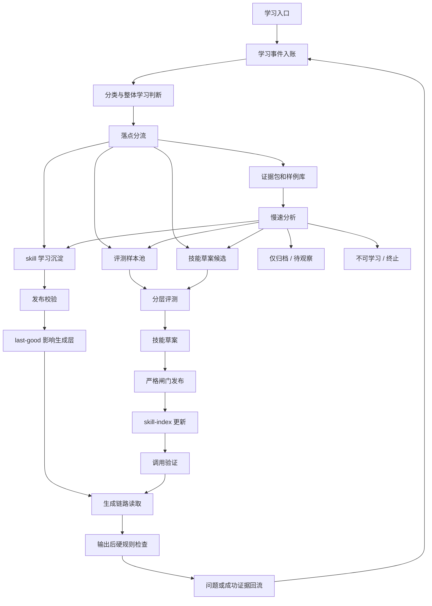

# 自主学习机制闭环重构方案

状态：已进入开发拆分（方案层 P0/P1 已清零，保留 P2/待产品取舍项）
日期：2026-07-04  
适用范围：对话学习、样例投喂、自动检测、画布归档、稳定 skill、技能进化和学习资料库

> 2026-07-05 架构收敛修订：当前阶段没有独立“当前规则层”，也不提供规则开关。学习机制收敛为“稳定 skill 驱动生成，学习资料库集中展示”。对话学习、样例、归档和纠错默认进入学习资料库；只有技能学习入口中明确、可执行的分镜要求，才允许写入稳定 skill 的学习沉淀参考，并由下一次生成读取。分镜台词长度等可程序校验硬规则必须由稳定 skill 提示和输出后校验器共同保证；输出不合规则拦截并回流失败记录，不再自动拆行后当作成功交付。历史章节中出现的“当前整体规则层 / current-ruleset / currentRulesUsed”只按旧设计背景理解，不作为当前开发依据，也不得展示为已影响生成。

> 执行优先级：如果本文后续历史段落仍出现“当前整体规则、current-ruleset、规则开关、自动修正后成功交付”等旧口径，一律按本修订条废止处理。当前开发、页面、验收和排查只以“学习资料库 + 稳定 skill / skill 学习沉淀 + 输出后校验失败回流”为准。

## 一、文档目的

本文用于统一最新一轮关于“学习机制闭环”的讨论结论，避免继续在旧 M0-M6 文档、技能说明、学习记录和页面补丁之间分散推进。

本文不是逐行编码计划，但应作为后续开发拆分、第三方验收和问题排查的统一依据。后续开发前，应先在主窗口确认本文的业务闭环、状态定义、数据落点和用户可见表达。

本文采用“先客户说明、再用户旅程、最后技术细节”的阅读顺序：前半部分先回答客户和新手最关心的“学什么、会不会影响生成、学错了怎么办”，后半部分再定义状态映射、存储、任务锁、评测和 skill 发布细节。

本文要解决的核心问题：

1. 学习入口很多，但入账、分类、落点、是否影响生成、评测、技能进化之间没有完整闭环。
2. 当前阶段已取消独立规则层；学习结果必须区分“已保存”“已写入稳定 skill 沉淀”“已被生成链路读取并通过校验”。
3. 画布归档目前更接近冻结存档，没有真正转化为成熟学习证据。
4. 技能进化目前偏草案和建议，没有形成安全发布与调用验证闭环。
5. 学习资料库展示的信息不足，用户难以判断“到底学到了哪里”。

## 客户能听懂的一页说明

这套学习机制的目标不是让系统“什么都自动改”，而是让系统把有价值的经验先记清楚、能追溯、能解释，再在安全范围内影响后续生成。

### 这套学习机制会学什么

| 会学习的内容 | 用户理解 | 第一阶段默认落点 |
| --- | --- | --- |
| 明确规则 | 用户直接说出的硬性要求，例如字数、字段、镜头连续性 | 普通学习先入学习资料库；技能学习入口中的明确分镜要求可写入稳定 skill 学习沉淀，并绑定校验器 |
| 整体偏好 | 从少量真实项目里沉淀出的常用风格、表达方式和工作习惯 | 学习资料库、技能草案 |
| 满意样例 | 用户投喂或确认满意的剧本、分镜、画布结果 | 样例库、证据包、评测样本池 |
| 纠错结果 | 用户指出“这条学错了”“这次是特殊处理”“先停用” | 纠错事件、覆盖事件、收窄事件 |
| 归档证据 | 被设为最终版本、导出、归档或被后续节点引用的结果 | 成熟证据包、样例库、评测样本池 |

### 这套学习机制不会做什么

- 不会因为一次样例投喂就直接改整体生成能力。
- 不会因为学习任务失败而卡住创作、生成、画布编辑或交付。
- 不会把样例直接当成规则；样例默认先保存，只有被整理、评测和确认后才可能影响生成。
- 不会自动修改正式 skill；skill 或小技能发布必须走评测和人工确认闸门。
- 不会把“已保存”伪装成“已影响生成”；用户必须能看出这条记录现在是否会影响后续生成。
- 不会把“保存到学习资料库”当成已经影响生成；当前只有稳定 skill、skill 学习沉淀参考或可调用小技能才会被生成链路读取。
- 不会只靠提示词承诺硬规则；硬规则必须由稳定 skill 和输出后校验器共同保证。
- 不会把程序无法稳定识别的偏好规则包装成“强制生效”；这类规则只能说明已参与生成或进入评测观察。
- 不会把用户明确说成“只这次这样”的临时要求沉淀为整体规则。

### 用户能控制什么

| 用户想知道或控制的事 | 页面必须给出的答案 |
| --- | --- |
| 系统学到了哪里 | 显示学到的摘要、来源、落实位置和证据 |
| 是否会影响生成 | 明确显示“暂不影响生成”或“已影响生成” |
| 是否进入整体能力 | 显示“已影响生成”或“暂不影响生成”；普通学习默认暂不影响生成，只有稳定 skill 或已写入 skill 沉淀的要求才可能影响生成 |
| 学错了怎么办 | 提供“带引用去纠正”，把关联记录带回对话 |
| 下一步要不要管 | 每条记录显示“用户下一步”，例如不用管、补一句确认、补一个样例、归档当前画布 |

### 一句话讲清状态

- `已保存`：系统记下来了，但暂时不会影响后续生成。
- `已影响生成`：这条已经进入正式稳定 skill、skill 学习沉淀参考或可调用小技能，会被生成链路读取；普通学习记录不能显示为已影响生成。
- `待确认`：系统还缺一句“是否长期”的确认、一个样例、一次归档或一次纠正；页面必须显示具体动作标签。
- `失败`：学习流程失败，但不影响继续创作；用户可以重试或带引用纠正。
- `已被覆盖`：旧记录还保留证据，但不再作为当前影响生成的结果。

规则执行成功必须分清两种承诺：

- 可程序校验的硬规则：必须证明“已读取、已执行、已校验”，否则不能算执行成功。
- 程序无法稳定校验的偏好或方法论：只能说明“已参与生成”或“待评测观察”，不能承诺稳定强制执行。

## 客户信任与控制

客户能接受学习机制的前提，是知道系统不会越权学习，也知道自己能看见和纠正学习结果。

1. 默认整体学习。第一阶段客户少、样本少，窗口、画布和项目只作为证据来源，不作为默认隔离层。
2. 用户明确说“以后都这样”“按这个方式做”“默认这样”时，第一阶段优先进入学习资料库；若是分镜技能学习入口中的明确可执行要求，可写入稳定 skill 学习沉淀参考。
3. 只有稳定 skill、skill 学习沉淀参考或可调用小技能会进入生成链路；明显临时、明显特殊、与现有能力冲突或证据不足的内容，停留在 `已保存` 或 `待确认`。
4. 学习资料库默认可见、可解释、可纠正。默认视图不展示 `topicKey`、L0/L1/L2、`skill-index`、token 或失败堆栈，只展示新手能理解的信息。
5. 第一阶段支持停用、覆盖、收窄和回退。用户发现学错后，系统必须能生成纠错事件，并把旧记录保留为可追溯证据。
6. 物理删除、账号级权限、客户空间级规则属于后置治理项。第一阶段不把这些概念混入主闭环，避免开发和用户理解同时发散。
7. 学习失败不能阻断业务。失败记录必须说明失败阶段、是否影响生成和用户下一步；正常创作链路继续可用。
8. 所有学习相关展示集中在学习资料库。对话、画布和生成页只保留学习触发、轻提示和跳转入口，不承载学习记录、评测结果、规则详情或技能草案详情。

对客户展示时，只讲 `已保存`、`已影响生成`、`待确认`、`失败`、`已被覆盖` 这类状态，不讲窗口、画布、项目多层隔离，也不讲内部落点编号、评测层级和技能索引细节。

## 用户旅程总览

本节优先服务客户演示、产品评审和新手理解。开发实现细节见后文状态映射、落点分流、评测和存储结构。

| 场景 | 用户看到什么 | 系统做什么 | 是否影响生成 | 用户下一步 | 终态 |
| --- | --- | --- | --- | --- | --- |
| 用户投喂一个满意样例 | `已保存`，落实位置为样例库或评测样本池 | 入账、生成证据、判断样例质量，必要时进入评测样本池 | 默认暂不影响 | 不用管；样本不足时补一个样例 | 成为可追溯样例或评测证据 |
| 用户说“以后都这样” | 普通对话学习显示 `已保存` 或 `待确认`；技能学习入口的明确分镜要求可显示 `已影响生成` | 普通学习先入库；技能学习明确要求写入稳定 skill 学习沉淀并等待下一次生成验证 | 只有写入稳定 skill 学习沉淀后才影响生成 | 不用管；如果学错可带引用去纠正 | 学习资料库可追溯；skill 沉淀被生成链路读取并接受输出校验 |
| 用户归档当前画布 | `已保存`，落实位置为证据包、样例库或评测样本池 | 将最终版本、采纳信号和检查结果打成成熟证据，保留项目和画布来源 | 默认暂不影响 | 不用管；后续重复出现或用户确认后可进入技能草案 | 成熟证据进入后续评测或归纳 |
| 用户发现系统学错 | `待确认 / 待纠正` 或相关记录显示可纠正入口 | 带 `recordId`、`eventId`、`sourceEventIds`、`landingIds`、`outputId` 等主定位字段，以及项目、画布、主题等上下文字段回对话，生成 `correctionEvent` | 纠正前按原记录状态；无法定位时暂不影响新的发布 | 点击“带引用去纠正”，说明停用、覆盖或收窄 | 生成停用、覆盖、收窄或待评测事件 |
| 样本不足 | `待确认 / 待补样例` | 生成待补样例任务，说明缺满意样例、问题样例还是修正前后对比 | 暂不影响 | 补一个样例或归档当前画布 | 补齐后自动重新评测 |
| 要求冲突或临时性不明 | `待确认 / 待确认是否长期` 或 `待确认 / 待纠正` | 暂停写入 skill 沉淀，保留现有稳定 skill，等待用户确认或评测 | 暂不发布新影响；现有稳定 skill 继续 | 说明这是长期默认还是只这次特殊处理；必要时带引用纠正 | 冲突解决后写入 skill 沉淀、收窄、覆盖或继续待观察 |

这 6 个场景是第一阶段必须讲清楚、跑通和验收的主闭环。其他细节可以进入实现反馈中继续校准，但不能破坏这些场景的入口、状态、用户下一步、系统动作和终态。

## 审查收敛标准

为了避免方案无限重写，后续评审按问题级别收敛，而不是按“还能不能再优化”无限扩散。

| 级别 | 必须处理的情况 | 处理原则 |
| --- | --- | --- |
| P0 | 任一学习入口无法入账、无法追溯、会误改整体生成、会卡住创作 | 必须补齐方案，不允许进入开发拆分 |
| P1 | 用户不知道是否影响生成、无法纠错、看不懂下一步、无法区分已保存和已写入 skill 沉淀、把偏好参与生成误解为硬规则强制生效 | 必须补齐方案，不允许只靠实现阶段补文案 |
| P2 | 文案细节、布局、Tab 归属、样例数量阈值、按钮位置 | 可以进入实现阶段边做边校准 |

方案冻结条件：

1. P0/P1 问题清零。
2. 每个入口都有入账、落点、状态、是否影响生成、用户下一步和终态。
3. 每个影响生成结果都能追溯证据来源、发布原因和回退路径。
4. 每个未影响生成结果都不会被误展示成已影响生成。
5. 剩余问题只保留明确 P2 或待产品取舍项，并写入待确认清单。

当前只保留两个开放项，不继续扩散：

1. L1 小样本回归第一批样本从哪些归档或历史样例中选。
2. 学习资料库是否把“评测记录”做成独立 Tab，还是先放在学习记录详情中。

当前评审结论：方案层 P0/P1 已清零，以上两个开放项属于 P2 或产品取舍，不阻塞开发拆分。本文进入“可拆开发任务与验收稿”状态：先拆学习事件账本、稳定 skill 学习沉淀、样例和证据包、评测回流、学习资料库默认视图，再拆 skill 晋升与发布。这里的 P0/P1 清零只代表方案已收敛，不代表当前代码实现已经通过验收。

开发执行拆分已单独落到 [2026-07-04-learning-loop-implementation.md](superpowers/plans/2026-07-04-learning-loop-implementation.md)。本文继续作为业务闭环、状态定义和第三方验收依据；执行计划用于后续分任务开发、提交和回归。

## 客户演示脚本

### 3 分钟讲清

1. 先讲系统会学什么：明确规则、整体偏好、满意样例、纠错结果和归档证据。
2. 再讲系统不会越权：样例不会直接变规则，临时要求不会沉淀成整体能力，学习失败不会卡住创作，正式 skill 不会自动乱改。
3. 最后讲用户怎么控制：在学习资料库里看状态、是否影响生成、证据来源和下一步；发现学错时点“带引用去纠正”回到对话处理。

演示时只使用客户能听懂的状态：`已保存`、`已影响生成`、`待确认`、`失败`、`已被覆盖`。不解释 `topicKey`、L0/L1/L2、`skill-index`、任务锁和内部 token。

### 5 个演示场景

| 演示场景 | 要证明什么 | 成功标准 |
| --- | --- | --- |
| 技能学习硬规则 | 用户在技能学习入口说出的明确分镜要求能影响下一次分镜生成 | 记录显示 `已影响生成`，落实位置为分镜 skill 学习沉淀；生成结果通过输出后校验 |
| 样例入库 | 样例会被保存，但不会直接影响生成 | 记录显示 `已保存`，是否影响生成为暂不影响 |
| 归档证据 | 最终画布能变成成熟证据 | 记录能追溯项目、画布、版本和采纳信号 |
| 学错纠正 | 用户能低成本纠正错误学习 | 点击“带引用去纠正”后生成 `correctionEvent` |
| 样本不足 | 用户知道缺什么、补完会怎样 | 显示 `待确认 / 待补样例`，补样例后重新触发评测 |

## 二、核心原则

1. 用户创作流程不能被学习流程卡住。学习失败、排队、评测失败、技能草案失败，都不能阻塞对话、画布编辑、剧本生成和分镜生成。
2. 正常生成链路只读取稳定 skill、skill 学习沉淀参考和可调用小技能，不实时扫描学习事件账本。
3. 学习事件账本只做追加留痕，不物理覆盖，不直接参与实时生成。
4. 学习不等于全部写入 skill。很多学习应先停留在学习资料库、样例库、证据包或评测样本池。
5. 当前阶段没有独立规则层；只有稳定 skill、skill 学习沉淀参考或可调用小技能能进入生成链路。
6. skill 或小技能必须走严格闸门，不能因为单条反馈或单个归档项目直接发布。
7. 归档代表一次真实交付最终可用，是整体学习的重要证据，但不等于可以直接改正式 skill。
8. 临时要求判断先于影响生成判断。用户明确说“只这次”或系统判断明显特殊时，不应进入整体影响生成层。
9. 用户可见页面使用简单语言，不暴露 M0-M6、topicKey、M4 等内部术语。
10. 学习资料库只读查看。用户纠错、补充、调整学习结果，应回到正常对话或创作页面触发。

## 三、用户可见概念

学习页面建议统一命名为“学习资料库”。页面只读，不作为规则编辑器。

所有和学习相关的展示都放在学习资料库这一页。其他业务页面可以触发学习，但不展示学习详情。

| 页面或位置 | 允许展示 | 不允许展示 |
| --- | --- | --- |
| 学习资料库 | 学习记录、影响生成、样例归档、评测记录、技能库、失败详情、待补样例任务、纠错入口 | 复杂规则编辑器 |
| 对话页 | “已保存，可到学习资料库查看”这类轻提示；从学习资料库带引用回来的纠错输入 | 学习记录列表、规则详情、评测日志、技能草案详情 |
| 画布页 | 归档入口、保存成功提示、跳转学习资料库入口 | 学习状态面板、规则列表、评测结果详情 |
| 生成结果页 | 生成后的采纳、归档、纠错入口 | 独立学习详情、独立规则管理 |
| 项目或设置页 | 学习资料库入口 | 独立项目学习页、独立规则后台 |

因此，“评测记录”可以是学习资料库内部的独立 Tab，也可以先放在学习记录详情中；但不能做成学习资料库之外的另一个学习页面。

学习资料库负责展示和发起学习相关动作；其他页面只负责完成动作并回流结果：

| 学习资料库动作 | 跳转或打开的位置 | 完成后必须回流 |
| --- | --- | --- |
| 补一句确认 | 对话页，自动带入关联学习记录和可编辑话术 | 生成确认事件，重新判断 `learningMode` 和落点 |
| 补一个样例 | 对话页或样例上传入口，自动带入缺失样例类型 | 生成样例事件，重新触发对应评测或样例分析 |
| 归档当前画布 | 画布页归档入口 | 生成成熟证据包，更新学习资料库记录状态 |
| 带引用去纠正 | 对话页，自动带入关联记录和纠错话术 | 生成 `correctionEvent`，进入覆盖、收窄、停用或待评测 |
| 查看评测结果 | 学习资料库内部评测记录或详情 | 不跳出学习资料库 |

其他页面完成动作后，只能显示轻提示，例如“已提交，可到学习资料库查看处理进度”。学习状态、失败原因、评测详情和规则详情仍回到学习资料库查看。

### 新手说明与轻教程

客户能接受学习机制的前提，是不用先学一套复杂概念。学习资料库需要轻量说明，但不做强制教程、不做跨页教学、不阻塞创作。

建议保留以下轻说明：

| 位置 | 说明内容 | 目标 |
| --- | --- | --- |
| 首次进入学习资料库 | 三句话说明：系统学到了什么、是否影响生成、学错了怎么改 | 让新手 30 秒内理解页面用途 |
| 状态说明入口 | 解释 `已保存`、`已影响生成`、`待确认`、`已被覆盖`、`失败` | 避免把“已保存”误解为已经影响生成 |
| 空状态 | 告诉用户现在还没有学习记录，以及可以通过满意样例、归档画布、纠错来积累学习 | 避免空页面让用户误以为功能坏了 |
| 每条记录详情 | 固定展示“是否影响生成”和“用户下一步” | 让用户知道是否需要处理 |
| 待确认记录 | 直接给动作按钮，例如“补一句确认”“补一个样例”“归档当前画布”“带引用去纠正” | 避免只展示状态、不知道怎么继续 |
| 从其他页面跳入 | 自动定位到关联学习记录，并高亮下一步 | 让用户知道刚才的提示对应哪条记录 |

不建议：

- 不做多步骤强制新手教程。
- 不在对话页、画布页、生成结果页重复解释学习机制。
- 不用大段技术说明解释 `learningMode`、`topicKey`、`conflictKey`、评测层级或任务锁。
- 不把学习资料库做成复杂规则编辑后台。

轻教程验收：

1. 新手第一次打开学习资料库，能说清“这里是看系统学到了什么的地方”。
2. 新手能区分“已保存”和“已影响生成”。
3. 新手看到 `待确认` 能知道下一步点哪个按钮。
4. 新手发现学错时，能从记录详情进入“带引用去纠正”。
5. 用户从对话、画布或生成结果页跳入学习资料库时，能定位到对应记录。

用户主要看到五类内容：

| 页面区域 | 用户理解 | 展示重点 |
| --- | --- | --- |
| 学习记录 | 系统听到并处理过什么 | 时间、来源、状态、学到的摘要、落实位置、失败原因 |
| 影响生成 | 现在会影响后续生成的技能或技能沉淀 | 稳定 skill、skill 学习沉淀、可调用小技能、来源证据 |
| 样例归档 | 已入库的成熟样例和归档结果 | 项目、画布、最终版本、是否已采纳、可复用范围、证据质量 |
| 评测记录 | 系统如何判断学习是否有效 | 检查项、结果、失败原因、关联规则或技能草案 |
| 技能库 | 系统当前具备哪些能力 | 技能说明、适用场景、是否基础技能或派生技能 |

用户侧状态保持简化为六类：

- 处理中
- 待确认
- 已保存
- 已影响生成
- 已被覆盖
- 失败

说明：

- “已保存”表示学习结果已经落到学习资料库、样例库、证据包、评测样本池或技能草案，暂不影响生成。
- “已影响生成”表示学习结果已经进入生成链路会读取的位置，例如稳定 skill、skill 学习沉淀参考或可调用小技能。对硬规则来说，还必须有输出后校验结果；只显示“已写入”不能等同于业务执行成功。
- “待确认”表示系统需要用户补一句确认、补一个样例、归档当前画布或纠正关联对象。页面必须同时显示具体动作标签，不能只显示“待确认”三个字。
- 不再把“已生效”作为用户主状态，避免用户误以为所有已落地内容都会影响后续生成。
- 不使用“已忽略”作为用户状态。低价值或不采用的内容可以在详情里说明“未进入影响生成层”，但不作为主状态打扰用户。

### 用户可见表达

学习资料库的详情页不向用户暴露 `topicKey`、L0/L1/L2、`skill-index` 等内部术语。用户只需要看懂五件事：

1. 学到了什么。
2. 从哪里学到。
3. 用在哪里。
4. 是否会影响后续生成。
5. 如果学错了，应该如何纠正。

每条学习记录详情必须显示：

```text
状态：已影响生成
落实位置：分镜 skill 学习沉淀
是否影响生成：会，影响后续整体生成
来源：画布归档
证据：最终剧本 v2、分镜 v3、用户采纳清单
用户下一步：不用管；如果不对，可以点击“带引用去纠正”
```

如果学习结果只是进入样例库或评测样本池，应明确写成：

```text
状态：已保存
落实位置：样例库
是否影响生成：暂不影响生成
说明：后续只有整理进稳定 skill、skill 学习沉淀或可调用小技能后，才会影响生成。
用户下一步：不用管；后续重复命中或进入评测后，系统会再推进
```

每条学习记录必须显示“用户下一步”。第一阶段只允许以下五类，避免新手看不懂：

| 用户下一步 | 适用情况 | 用户看到的含义 |
| --- | --- | --- |
| 不用管 | 已保存、已影响生成、已被覆盖且无需处理 | 系统已经处理完 |
| 补一句确认 | 不确定是长期默认还是临时特殊处理 | 说清楚“以后都这样”或“这次只是特殊处理” |
| 补一个样例 | 样本不足或评测不足 | 再提供一个满意稿、问题稿或修正前后对比 |
| 归档当前画布 | 当前结果已经满意但缺少成熟证据 | 把当前画布作为最终证据保存 |
| 带引用去纠正 | 用户发现系统学错、长期性判断错或规则冲突 | 带着这条学习记录回到对话里纠正 |

因此，用户侧不再使用“已生效”表达学习结果。内部可以继续使用“落地”“进入影响生成层”等术语，但页面必须明确区分“已保存”和“已影响生成”。

落点到用户状态必须使用固定映射，避免前端、后端和任务队列各自解释：

| 内部落点或情况 | 用户主状态 | 具体动作标签 | 是否影响生成 |
| --- | --- | --- | --- |
| 样例库 | 已保存 | 不用管 | 暂不影响 |
| 证据包 | 已保存 | 不用管 | 暂不影响 |
| 评测样本池 | 已保存 | 不用管 | 暂不影响 |
| 技能草案 | 已保存 | 等待人工确认 | 暂不影响 |
| 仅归档 | 已保存 | 不用管 | 暂不影响 |
| 标记不可学习 | 已保存 | 可带引用去纠正 | 不会影响 |
| skill 学习沉淀 | 已影响生成 | 不用管 / 带引用去纠正 | 会，影响后续对应 skill 生成 |
| 正式 skill | 已影响生成 | 不用管 / 带引用去纠正 | 会，按技能路由影响 |
| 可调用小技能 | 已影响生成 | 不用管 / 带引用去纠正 | 会，按技能路由影响 |
| 待观察 | 待确认 | 待确认是否长期 / 待补样例 / 待归档 | 暂不影响 |
| 样本不足 | 待确认 | 待补样例 | 暂不影响 |
| 冲突不明 | 待确认 | 待纠正 | 暂不影响，直到确认 |
| 无法定位纠错对象 | 待确认 | 待纠正 | 暂不影响，直到确认 |
| 失败任务 | 失败 | 重试 / 带引用去纠正 / 不用管 | 按失败详情显示 |
| 被替代或收窄的旧记录 | 已被覆盖 | 不用管 | 不再影响 |

“待确认”的页面主文案必须展示具体动作标签：

| 具体动作标签 | 用户要做什么 | 用户完成后的系统动作 |
| --- | --- | --- |
| 待确认是否长期 | 说明这是长期默认还是只这次特殊处理 | 重新判断是否进入整体影响生成层 |
| 待补样例 | 补满意样例、问题样例或修正前后对比 | 重新触发评测或样例分析 |
| 待归档 | 归档当前画布 | 生成成熟证据包 |
| 待纠正 | 带引用回对话说明哪里学错 | 生成纠错事件、覆盖或收窄事件 |

### 术语边界

为避免后续实现把状态混用，本文中以下术语只按本表含义使用：

| 术语 | 明确定义 | 不代表 |
| --- | --- | --- |
| 入账 | 原始触发被追加到学习事件账本，并带来源、时间和关联对象 | 学习已经成功 |
| 落点 | 学习结果被分配到学习资料库、样例库、评测样本池、技能草案或稳定 skill 学习沉淀等承接位置 | 已经发布或已影响生成 |
| 落地 | 学习结果已经写入某个承接位置，并能追溯证据 | 生成链路一定会读取 |
| 影响生成层 | 生成链路实际读取的正式稳定 skill、skill 学习沉淀参考或可调用小技能 | 所有学习资料 |
| skill 学习沉淀 | 已写入稳定 skill references、会被对应 skill 加载的明确要求 | 所有对话学习记录 |
| 技能草案候选 | 可能修改 skill 的候选建议 | 已经进入生成链路 |
| learningMode | 学习事件和落点的处理模式，用于区分整体规则、临时要求、证据、待确认和纠错 | 用户可见状态 |
| topicKey | 用于归类、检索和聚合相似学习事件的主题键 | 规则互斥键 |
| conflictKey | 用于判断同类规则是否互斥的冲突键 | 主题分类 |
| 已保存 | 用户侧状态，表示学习结果已落地但暂不影响生成 | 已进入生成链路 |
| 已影响生成 | 用户侧状态，表示学习结果已经被生成链路读取 | 永远正确或不可纠正 |
| 待确认 | 用户侧状态，表示系统需要用户补充证据或确认是否长期默认 | 系统无法继续工作 |
| 采纳 | 用户明确接受、最终归档、标记满意，或把结果作为最终交付版本使用 | 模型输出过一次校验 |
| 覆盖 | 新规则收窄、替换或停用旧规则，并保留旧规则引用 | 物理删除旧证据 |

## 四、内部对象分层

学习结果必须先分层，再决定是否影响生成。

| 内部对象 | 作用 | 是否直接影响生成 | 典型来源 |
| --- | --- | --- | --- |
| 学习事件 | 原始触发记录 | 否 | 对话、归档、样例、校验、用户纠错 |
| 证据包 | 可追溯材料集合 | 否 | 归档画布、满意样例、修正前后对比 |
| skill 学习沉淀 | 会被后续对应 skill 读取的明确要求，保存于稳定 skill references | 是，仅限已写入稳定 skill 的内容 | 技能学习入口中的明确分镜要求 |
| 临时要求 | 本轮对话或本次生成的特殊要求 | 只影响当前运行，不持久化 | 用户明确说“这次先这样”“只这版这样” |
| 样例库 | 可参考的成熟样例 | 默认否 | 用户投喂、画布归档 |
| 评测样本池 | 用于验证规则和技能是否变好 | 否 | 归档、样例、修正结果 |
| 技能草案 | 可能修改 skill 的候选方案 | 否 | 多证据归纳、评测通过建议 |
| 正式 skill | 能力入口和方法论 | 是 | 严格闸门发布 |
| skill-index | 派生技能和技能路由索引 | 是，决定是否能被调用 | 技能发布流程 |

关键边界：

- 学习事件不是规则。
- 证据包不是规则。
- 样例库不是规则。
- 归档不是生成规则，但可以成为整体学习证据。
- 技能草案不是正式 skill。
- skill 文件存在不等于生成链路已经调用。

## 规则可验证性分级

学习机制必须先判断规则能否被程序稳定识别，再决定落点和对用户的承诺。不能把所有规则都包装成同一种“已生效”。

| 规则类型 | 程序识别能力 | 例子 | 生效承诺 | 第一阶段落点 |
| --- | --- | --- | --- | --- |
| 可程序强校验硬规则 | 能稳定识别和判定 | 台词字数、字段完整、镜号连续、字段标准化后的运镜占比、原台词保留文本对齐 | 必须进入稳定 skill 或生成约束，并绑定程序校验器；违规时拦截并失败回流 | 稳定 skill / skill 学习沉淀 / 生成约束 / 校验器 |
| 半结构化规则 | 能做部分检测，但需要模型或人工辅助判断 | 景别与画面是否一致、镜头运动是否贴合动作、反打关系是否成立 | 只能承诺参与生成和进入评测，不能承诺稳定强制生效 | 技能草案候选、评测任务、问题证据 |
| 偏好和方法论 | 程序无法稳定判断 | 节奏、爽点、人物动机、风格、张力、商业感 | 只能显示“已参与生成”或“待观察”，不能显示为硬性生效证明 | 样例库、证据包、技能草案、人工评测 |

硬规则落地原则：

1. 硬规则不能只写进学习资料库，也不能只靠 prompt。稳定 skill 只是让模型知道规则，不能保证模型一定遵守。
2. 真正的硬规则生效证明必须来自：稳定 skill 或 skill 学习沉淀已被加载、输出后程序校验通过；校验失败时必须拦截并回流失败记录。
3. 当前阶段没有独立规则层；硬规则执行责任由稳定 skill、生成约束和校验器共同承担。
4. 程序暂时识别不了的规则，不允许对客户承诺“稳定生效”；页面必须显示为参与生成、待评测或待确认。
5. 第一阶段优先把台词字数、字段完整、镜号连续、可标准化字段占比这类硬规则做成校验器，而不是继续堆 prompt。

## 五、学习入口与默认落点

| 入口 | 默认通道 | 默认落点 | 是否可快速影响生成 |
| --- | --- | --- | --- |
| 用户明确规则 | 快速通道 | 学习资料库；技能学习入口的明确分镜要求可写入 skill 学习沉淀 | 只有写入稳定 skill 沉淀后可以 |
| 用户反复纠错 | 快速加慢速 | 学习事件、纠错证据、技能草案线索 | 同主题重复 2 次以上且可整理进 skill 时可以 |
| 用户投喂样例 | 慢速通道 | 样例库、评测样本池、证据包 | 不直接影响生成 |
| 画布归档 | 慢速通道 | 成熟证据包、样例库、评测样本池 | 不直接改 skill |
| 自动检测失败 | 慢速通道 | 问题证据、回归线索 | 不直接影响生成 |
| 用户修正问题 | 快速加慢速 | 纠错事件、skill 沉淀收窄线索、正向证据 | 明确覆盖或收窄并写入稳定 skill 后可以；满意稿只作证据 |
| 用户说学错了 | 快速通道 | 降质或纠错事件、覆盖候选 | 可以生成纠错事件；不暗中改 skill |
| 多次真实证据有效 | 慢速通道 | 技能草案、派生技能候选 | 不能直接发布 |

判定口径：

- 可执行：能写成一句明确规则，包含适用对象、动作和约束；不能只写“更高级”“更好看”“更有感觉”。
- 低风险：不放宽硬性交付底线，不盲改 skill，不把明显临时或特殊个案写入 skill 沉淀。
- 成熟证据：来自最终稿、归档稿、明确采纳结果或用户确认的满意稿，并能关联到项目、画布、版本和检查结果。
- 稳定方法论：来自多次满意样例、归档证据或纠错结果，且用户没有把它限定为临时特殊处理，并通过必要评测。
- 证据质量：高表示有最终版本、采纳信号和检查结果；中表示有最终版本但采纳或检查不完整；低表示来源不清、版本不完整或无法关联项目。

## 六、整体学习判断

第一阶段的默认策略是整体学习。窗口、画布和项目只作为来源字段，帮助追溯证据，不作为默认学习隔离层。

学习事件入账后，先判断它属于哪一类：

| 类型 | 用户表达或证据 | 默认处理 | 是否影响生成 |
| --- | --- | --- | --- |
| 临时要求 | “这次先这样”“只这一版”“当前画布特殊处理” | 只进入对话运行态或学习记录，不写入稳定 skill 沉淀 | 只影响当前运行 |
| 整体要求 | “以后都这样”“默认这样”“不要再这样”“必须这样” | 普通对话学习先保存；技能学习入口的明确分镜要求可写入稳定 skill 沉淀 | 写入稳定 skill 沉淀并被生成链路读取后影响生成 |
| 整体证据 | 满意样例、归档画布、修正前后对比 | 进入证据包、样例库或评测样本池 | 默认暂不影响 |
| 整体技能候选 | 多次证据指向稳定流程或方法论 | 进入技能草案候选，走 L1/L2 和人工确认 | 发布后影响后续生成 |
| 不确定 | 临时性不清、冲突不明、样本不足 | 进入 `待确认`，显示具体动作标签 | 暂不影响 |

`learningMode` 必须使用固定枚举，避免事件账本、学习资料库和技能沉淀各自解释：

| learningMode | 含义 | 默认落点 | 是否可直接影响生成 |
| --- | --- | --- | --- |
| `overall` | 已判断为长期默认或硬性整体要求 | 学习资料库；技能学习入口的明确分镜要求可写入稳定 skill 学习沉淀 | 只有写入稳定 skill 或可调用小技能后才可以 |
| `temporary` | 只本轮、只这次或明显特殊处理 | 对话运行态 / 学习记录 | 不可以 |
| `evidence` | 只作为满意样例、归档证据或评测样本 | 证据包 / 样例库 / 评测样本池 | 不可以 |
| `uncertain` | 暂时无法判断是否长期默认、样本不足或冲突不明 | 待确认 / 待观察 | 不可以 |
| `correction` | 用户纠错、停用、覆盖或收窄 | 纠错事件 / 覆盖候选 / 回归评测线索 | 只有后续明确写入稳定 skill 或可调用小技能后才可以 |

约束：

- `events.jsonl` 必须记录 `learningMode`、`topicKey` 和 `conflictKey`，用于聚合和纠错定位。
- `learningMode=overall` 不等于影响生成；只有后续写入稳定 skill、skill 学习沉淀参考或可调用小技能后，才可显示 `已影响生成`。
- `temporary`、`evidence`、`uncertain` 和 `correction` 可以触发后续分析，但不能直接进入影响生成层。
- `correction` 事件如果生成了新要求，必须产生新的学习事件或 skill 沉淀变更，不能直接改写原事件。

`learningMode` 到用户状态的默认映射：

| learningMode 和处理结果 | 用户主状态 | 具体动作标签 | 是否影响生成 |
| --- | --- | --- | --- |
| `overall` 已写入稳定 skill 沉淀 | 已影响生成 | 不用管 / 带引用去纠正 | 会 |
| `overall` 仍是候选，未写入稳定 skill 沉淀 | 待确认或失败 | 待纠正 / 重试 / 不用管 | 暂不影响，继续使用稳定 skill 基线 |
| `temporary` | 已保存 | 不用管 | 只影响本次运行，不影响后续生成 |
| `evidence` | 已保存 | 不用管 / 待补样例 / 待归档 | 暂不影响 |
| `uncertain` | 待确认 | 待确认是否长期 / 待补样例 / 待纠正 | 暂不影响 |
| `correction` 已覆盖或停用旧沉淀 | 已被覆盖或已保存 | 不用管 | 按覆盖结果显示 |
| `correction` 生成新整体规则并发布成功 | 已影响生成 | 不用管 / 带引用去纠正 | 会 |

用户侧状态仍以落点和处理结果为准；`learningMode` 只提供默认映射，不能替代固定落点状态表。

状态责任边界必须固定，避免 D1、D2、D7 和前端各自解释：

| 层 | 负责什么 | 不负责什么 |
| --- | --- | --- |
| D1 事件账本 | 保存原始触发、`learningMode`、内部处理阶段、原始任务状态、来源引用、落点线索、失败详情 | 不持久化 `已保存 / 已影响生成 / 待确认` 这类用户主状态 |
| D2 落点映射 | 根据落点、处理结果、失败状态和覆盖关系统一计算用户主状态、具体动作标签、是否影响生成和用户下一步 | 不写入原始事件，不让前端自行推导状态 |
| D7 学习资料库 API | 把 D2 计算结果作为默认视图字段返回，并把内部字段折叠到高级详情 | 不把 `topicKey`、L0/L1/L2、token、失败堆栈直接放进默认视图 |
| D8 前端页面 | 只渲染 D7 返回的用户可见字段和动作入口 | 不根据 `status`、`learningMode`、`landingIds` 自行二次判断主状态 |

如果旧事件中已经存在 `已生效` 或其他旧用户状态字段，迁移时只能作为历史输入读取，不能继续作为页面主状态来源。页面最终展示必须以 D2/D7 的统一映射结果为准。

来源字段必须保留，但不直接决定学习范围：

| 来源字段 | 用途 | 用户默认是否需要理解 |
| --- | --- | --- |
| `conversationId` | 找回是哪轮对话触发 | 否 |
| `projectId` | 证明来自哪个真实项目 | 否，默认只显示项目名称或来源摘要 |
| `canvasId` | 追溯到哪张画布或版本 | 否，默认只显示“来自画布归档” |
| `outputId` | 定位具体输出 | 否 |
| `sourceEventIds` | 追溯证据链 | 否 |

默认规则：

- 技能学习入口中的明确分镜硬规则，且与系统标准一致，可以写入稳定 skill 学习沉淀。例如“一个镜号只能有一行台词，台词超过 20 个字必须拆新镜号”。
- 普通对话中的风格偏好、表达偏好、题材偏好，第一阶段默认按整体学习资料保存；如果用户明确说“只这次”，只进入临时记录。
- 单个满意样例或单个归档画布默认先保存为整体证据，不直接变成 skill 沉淀；后续可进入技能草案或人工整理。
- 样例质量未知、来源不清、冲突不明时，只进入学习记录、样例观察区或 `待确认`。
- 判断不准时不覆盖旧 skill 沉淀，不盲改正式 skill。

### 稳定 skill 学习沉淀生命周期

第一阶段先做“稳定 skill + 学习沉淀 reference”。不做窗口级、画布级、项目级、客户级规则后台，也不做独立当前规则层。客户级、团队级、项目级细分治理等真实客户规模变大后再引入。

默认判断：

- 用户在技能学习入口说出明确分镜要求，且能落到现有分镜 skill 行为，进入 skill 学习沉淀候选。
- 用户只说“这次先这样”“这一版这样”“这个画布特殊处理”，只作为临时要求或证据，不写入 skill 沉淀。
- 用户投喂满意样例但没有说长期默认，先进入样例库、证据包或评测样本池。
- 明确硬性交付规则，且符合系统通用标准，可以进入稳定 skill 学习沉淀，并绑定输出后校验。例如分镜字段完整、台词长度限制、镜号连续性。

加载优先级：

```text
当前对话临时要求
-> 稳定 skill
-> skill 学习沉淀 reference
-> 分镜标准文档
-> 可调用小技能
```

约束：

- skill 学习沉淀不能静默放宽硬性交付底线。
- skill 学习沉淀不按窗口、画布或项目拆分；这些字段只用于证据追溯和纠错定位。
- 归档证据可以强化整体学习，但不能绕过校验直接改正式 skill。
- 用户说“这只是这次特殊处理”时，应生成临时或纠错事件，不能只写备注。
- 多条真实证据重复支持同一方法论时，才进入技能草案候选。

稳定 skill 学习沉淀保护：

- 当前阶段不再发布 `current-ruleset.json`，也不提供当前规则启用/停用开关。
- 普通学习记录只进入学习资料库；只有技能学习入口中的明确分镜要求，才允许写入稳定 skill 的学习沉淀参考。
- skill 学习沉淀只能补充对应 skill 的生成行为，不得改变既有分镜字段格式或绕过标准 skill。
- 同一类要求如果互相冲突，必须进入 `待确认 / 待纠正`，不能静默覆盖 skill 沉淀。
- skill 学习沉淀如果与硬性交付底线冲突，必须拒绝写入或进入待确认，不能覆盖底线。

稳定 skill 执行闭环：

1. `已写入 skill 沉淀` 只表示生成链路会读取，不等于输出已经满足规则。
2. 每次分镜生成前，系统必须加载稳定 skill、skill references 和分镜标准文档。
3. 对台词长度、字段完整、镜号连续等可程序校验的硬规则，必须绑定输出后校验器；没有校验器时不能承诺强制生效。
4. 输出违反硬规则时，不得静默当作成功交付；系统应拦截生成结果，在学习资料库显示 `失败` 或 `待确认 / 待纠正`，并说明是哪条规则未满足。
5. 对暂时无法程序校验的偏好规则，至少要记录本次已加载、适用原因和用户可纠正入口，不能用“已写入”替代生效证明。
6. 学习资料库中“已影响生成”的高级详情必须能追到：skill 文件或 reference、生成上下文证据、输出后校验结果。

独立规则层保持砍掉状态：

1. 页面不显示“当前规则”Tab，不提供规则启用/停用入口。
2. `/api/learning-library` 不返回可影响生成的 currentRules；历史 current-rule 事件只作为学习资料库历史记录展示。
3. 纠错入口只生成带引用纠正事件，不暗中停用或改写旧规则文件。
4. 生成链路只读取稳定 skill、skill 学习沉淀参考、分镜标准文档和可调用小技能。

`conflictKey` 生成规则：

- `conflictKey` 由学习分类阶段负责生成，必须写入学习事件、skill 沉淀候选和相关后台任务。
- 推荐格式为 `capability.ruleObject.constraintDimension`，例如 `storyboard.dialogue.max-chars`、`storyboard.shot-sequence.numbering`。
- `topicKey` 可以更粗，例如 `dialogue` 或 `shot-sequence`；`conflictKey` 必须细到能判断是否互斥。
- 两条规则只有 `conflictKey` 相同，才默认按互斥处理；`topicKey` 相同但 `conflictKey` 不同的规则可以并存。
- 如果系统无法生成稳定 `conflictKey`，不得写入 skill 沉淀，只能进入 `待确认 / 待纠正` 或待观察。

skill 沉淀版本和回退：

- 第一阶段不做自动版本化 skill 发布；正式 skill 修改仍走人工确认和备份。
- skill 学习沉淀 reference 写入失败时，学习记录只能显示 `已保存`、`待确认` 或 `失败`，不得显示 `已影响生成`。
- 生成链路加载 skill reference 失败时，不阻断创作；失败记录进入学习资料库，并继续使用稳定 skill 基线。

skill 沉淀纠错和停用：

- 第一阶段不在学习资料库做复杂规则编辑器。
- 学习资料库详情页提供“带引用去纠正”轻入口。点击后回到正常对话，并自动带上 `recordId`、`eventId`、`sourceEventIds`、`landingIds`、`outputId` 等主定位字段，以及 `projectId`、`canvasId`、`conversationId`、`topicKey`、`conflictKey` 和 `learningMode` 等上下文字段。
- `recordId` 和 `eventId` 是优先定位字段；没有独立 `recordId` 时，可用 `eventId` 作为稳定记录标识。`sourceEventIds`、`landingIds` 和 `outputId` 可用于定位原始事件、落点或输出。`projectId`、`canvasId`、`conversationId`、`topicKey`、`conflictKey`、`learningMode` 只能补强追溯，不能单独启用纠错按钮。若无法提供任一非空主定位字段，纠错入口必须禁用并说明原因。
- 对话框自动填入可编辑话术，用户可以直接发送，也可以补充说明。
- 第一批固定话术：
  - “这条 skill 沉淀先停用。”
  - “这次只是特殊处理，不要长期这样学。”
  - “刚才那条学错了，请按这次说明覆盖。”
  - “这条先保存成样例，不要影响后续生成。”
- 复制话术只作为兜底能力，不作为主交互。
- 带引用纠错只负责降低用户表达成本，不直接修改 skill 文件。
- 用户发送带引用纠错后，系统必须生成 `correctionEvent`，再按正常学习流程判断停用、收窄、覆盖或等待评测。
- 如果无法定位关联对象，不能直接覆盖 skill 沉淀；记录进入 `待确认 / 待纠正`，并显示“需要你补充是哪条记录”。
- 真正停用、收窄或覆盖仍通过正常对话触发，并生成新的学习事件、纠错事件或人工待办。
- skill 沉淀被覆盖或移除后仍保留证据和来源，不物理删除学习记录。

## 七、落点分流规则

每条学习事件入账后，应先判断落点。

```text
学习事件
  -> 是否明确、可执行、低风险
       是 -> skill 学习沉淀候选或技能草案候选
       否 -> 继续判断
  -> 是否是最终稿、满意稿或归档稿
       是 -> 证据包、样例库、评测样本池
       否 -> 继续判断
  -> 是否是反复纠错或质量下降
       是 -> 纠错事件、降质事件、回归评测线索
       否 -> 继续判断
  -> 是否形成多次真实证据支持的稳定方法论
       是 -> 技能草案候选
       否 -> 进入待观察 / 学习记录
```

不得直接发布的情况：

- 单个项目里的题材特殊处理，且用户没有确认长期默认。
- 未确认质量的样例。
- 用户只是临时要求。
- 与已有规则冲突但未评测。
- 无法判断是长期默认还是临时特殊处理。
- 自动归纳出来但没有证据链。

### 待观察和重入规则

“只保留学习记录”不是终点。证据不足但可能有价值的内容，应进入待观察状态。

进入待观察的典型情况：

- 用户表达了偏好，但没有说明是不是长期默认。
- 样例质量不确定，暂时无法判断是否可学。
- 同类问题只出现一次。
- 与现有规则可能冲突，但证据不够。
- 临时性无法判断。

待观察内容满足以下任一条件时，必须重新进入分类与落点分流：

- 同一 `topicKey` 下再次出现相似反馈。
- 后续画布归档或样例入库提供了证据。
- 用户明确确认“这个以后都要这样”。
- 自动检测或评测发现同类问题重复出现。
- 用户纠正“之前那条学错了”并指向相关记录。

待观察记录在学习资料库中不应打扰用户，但详情中必须显示“未进入影响生成层”、等待的证据类型和用户下一步。

待观察详情使用以下模板，避免新手不知道该做什么：

```text
状态：待确认
具体动作标签：待确认是否长期
为什么还没学进去：只出现过一次，系统还不能判断是不是长期规则。
是否影响生成：暂不影响生成
还差什么证据：再确认一次这是长期默认，或提供一个类似样例。
用户下一步：补一句确认，例如“以后都这样”或“这次只是特殊处理”。
补完后会发生什么：系统会重新分类，符合条件后进入 skill 学习沉淀、技能草案或继续保存为样例。
```

常见待观察场景的用户下一步：

| 场景 | 用户下一步 | 补完后的系统动作 |
| --- | --- | --- |
| 不确定是不是长期默认 | 待确认是否长期 | 重新判断是否进入 skill 学习沉淀、技能草案或继续保存 |
| 样例质量不确定 | 待补样例 / 待归档 | 进入样例库或评测样本池 |
| 临时性无法判断 | 待确认是否长期 | 重新进入整体学习判断 |
| 与旧规则冲突 | 待纠正 | 生成收窄、覆盖或待评测事件 |
| 自动检测只发现一次 | 待补样例或不用管 | 重复出现后再进入规则候选或回归评测 |

## 八、完整闭环流程



### 成功证据回流条件

图中的“成功证据”不是指任意一次生成看起来不错，而是指有明确采纳信号的正向证据。

可作为成功证据的情况：

1. 用户明确说“可以”“采用这个”“这个版本对”。
2. 用户把结果归档为最终剧本、最终分镜或交付版本。
3. 用户在修正后将修正结果设为最终版本、归档、导出、被后续节点引用，或明确确认用于交付。
4. 输出通过硬规则检查，且后续被用户选择为最终版本。

不能单独作为成功证据的情况：

1. 模型生成了一版内容，但用户没有表达采纳。
2. 只通过 L0/L1/L2 评测。
3. 用户没有反馈。
4. 页面停留、复制文本、继续对话等弱信号。
5. 普通继续聊天，但没有设为最终版本、归档、导出或被后续节点引用。

问题证据也要区分来源：用户明确纠错、自动检测失败、评测回归失败都可以形成问题证据；普通重试或重新生成不能直接视为问题证据。

闭环成立的条件：

1. 每个入口都能入账。
2. 每个事件都能找到落点。
3. 每个落点都有下一步或终态。
4. 每个已保存或已影响生成的结果都能追溯证据。
5. 每个失败都有原因。
6. 每个覆盖都有覆盖关系。
7. 每个正式 skill 发布后都验证能被调用。

### 闭环状态机

每条学习事件必须进入明确状态，不能只停留在“记录已生成”。

| 状态 | 含义 | 下一步 | 用户可见表达 |
| --- | --- | --- | --- |
| 已入账 | 已记录原始触发 | 分类与整体学习判断 | 处理中 |
| 已分类 | 已判断来源、能力域、是否长期默认 | 落点分流 | 处理中 |
| 待观察 | 有学习价值但证据不足 | 等待重复证据、归档证据或用户再次纠错 | 待确认，并显示用户下一步 |
| 已落地 | 已进入 skill 学习沉淀、样例库、评测样本或技能草案 | 校验、评测或等待使用 | 已保存或已影响生成，并显示落实位置 |
| 已验证 | 通过对应校验或评测 | 进入生成链路或发布流程 | 已保存或已影响生成 |
| 已进入生成链路 | 生成时会读取 | 输出后检查与证据回流 | 已影响生成 |
| 已被覆盖 | 被同主题新事件替代或收窄 | 保留证据，不再影响生成 | 已被覆盖 |
| 失败 | 入账、分类、发布、评测或加载失败 | 重试、等待纠错或终止 | 失败，并显示原因 |

状态约束：

- 待观察不是终态，必须能被重复反馈、归档证据、评测结果或用户确认重新唤醒。
- 已落地不等于一定影响生成。只有稳定 skill、skill 学习沉淀参考和可调用小技能才显示为“已影响生成”。
- 已进入生成链路后，输出必须进入硬规则检查或人工采纳回流，否则学习闭环没有闭合。

## 九、快速通道

快速通道用于明确规则，目标是让下一次生成尽快受益。

适用：

- 用户明确说“以后”“默认”“必须”“不要再”。
- 规则可执行、低风险、可表达为一句规则。
- 最好可被程序校验或人工清楚判断。

流程：

1. 入账为学习事件。
2. 判断能力域、是否长期默认和要求类型。
3. 生成 skill 沉淀候选卡。
4. 执行适用 skill、冲突和格式边界校验。
5. 写入稳定 skill 学习沉淀 reference。
6. 下一次生成加载并接受输出后校验。
7. 学习资料库显示“已影响生成”，并展示落实位置、证据来源和用户下一步。

注意：

- 本轮对话可以先按用户上下文执行。
- 不能在发布成功前告诉用户“已长期记住”。
- 发布失败必须显示失败原因，并通知用户查看。

## 十、慢速通道

慢速通道用于样例投喂、归档学习、复杂纠错、技能进化。

原则：

- 不阻塞创作。
- 不临时影响生成。
- 不直接扫描事件账本参与生成。
- 可以后台排队、重试和续跑。

慢速任务类型：

| 任务 | 输入 | 输出 |
| --- | --- | --- |
| 样例分析 | 用户投喂材料 | 样例条目、证据包、评测建议 |
| 归档分析 | 归档画布 | 成熟证据包、评测样本、技能草案线索 |
| 纠错归纳 | 反复纠错事件 | skill 沉淀收窄、覆盖建议、回归任务 |
| 评测执行 | skill 沉淀或技能候选 | 评测结果 |
| 技能草案 | 多证据和评测结果 | skill 修改草案或小技能草案 |

### 慢速分析出口

样例投喂、画布归档、复杂纠错进入慢速分析后，必须输出以下终态之一：

| 输出 | 含义 | 后续动作 |
| --- | --- | --- |
| 仅归档 | 有参考价值，但暂不形成规则 | 留在样例库或证据包，等待后续重复命中 |
| 生成评测任务 | 可用于检查规则或技能是否变好 | 进入评测样本池 |
| 生成 skill 沉淀候选 | 可表达为稳定 skill 补充要求 | 进入写入校验或人工确认 |
| 生成技能草案候选 | 形成稳定方法论或流程变化 | 进入 L1/L2 评测和人工确认 |
| 标记不可学习 | 质量差、来源不清或用户否定 | 保留证据，不进入影响生成层 |

慢速分析不能只生成报告。报告必须附带落点、下一步和终态判断。

“仅归档”和“标记不可学习”不能混用：

- 仅归档：材料暂不形成规则，但保留后续重入机会；后续重复反馈、归档证据或用户确认出现时，可重新进入分类。
- 标记不可学习：材料质量差、来源不清、用户否定或违反业务边界；除非用户明确翻案或提供新证据，否则不再进入影响生成链路。

用户侧表达：

- 仅归档显示为“已保存”，是否影响生成写“暂不影响生成”，用户下一步默认“不用管”。
- 标记不可学习显示为“已保存（仅保留记录）”，是否影响生成写“不会影响生成”；如果用户认为判断错了，用户下一步为“带引用去纠正”。

## 十一、画布归档学习

画布归档不是删除，也不是直接改整体规则或正式 skill。

归档后必须生成成熟证据包。建议字段：

| 字段 | 说明 |
| --- | --- |
| archiveId | 归档证据包编号 |
| canvasId | 来源画布 |
| projectId | 所属项目 |
| archivedAt | 归档时间 |
| finalNovelNodeId | 最终小说节点，可为空 |
| finalScriptNodeId | 最终剧本节点 |
| finalStoryboardNodeIds | 每集最终分镜节点 |
| episodeMap | 剧本集数和分镜集数对应关系 |
| userEdits | 用户修改链路摘要 |
| validationResults | 归档前检查结果 |
| skillRulesUsed | 当时命中的稳定 skill 或 skill 沉淀 |
| acceptedIssues | 用户选择“仍然采用”的问题 |
| fixedIssues | 用户已修正的问题 |
| sourceSnapshot | 最终文本快照或引用路径 |

重要规则：

- 有些使用场景没有小说，直接从剧本开始，归档判定不能强制要求小说。
- 归档证明一次真实交付成熟。
- 归档证据可以进入样例库和评测样本池。
- 归档证据经过多次真实交付或样例验证后，才可能推动 skill 草案。
- “仍然采用”不是正向学习证据，只表示用户接受当前结果，不应直接强化错误规则。

## 十二、分层评测

评测不能一刀切，否则会拖慢学习队列。

| 层级 | 名称 | 用途 | 成本 | 触发场景 |
| --- | --- | --- | --- | --- |
| L0 | 硬规则校验 | 判断明确规则是否满足 | 低 | 台词长度、字段完整、集数识别 |
| L1 | 小样本回归 | 判断 skill 沉淀或草案是否破坏典型样例 | 中 | 重要 skill 沉淀、重要技能草案 |
| L2 | 深度风格评测 | 判断方法论或 skill 草案是否整体变好 | 高 | skill 修改、小技能创建 |

示例：

- “台词每句 20 字以内”先走 L0。
- “运动镜头占比 30% 到 40%”可走 L0 加 L1。
- “某类剧本评审要更细化人物动机”应走 L1 或 L2。
- “根据归档项目总结出新的分镜方法论”必须走 L2，不能直接写 skill。

### 评测结果与动作

评测结果必须驱动动作，不能只保存为报告。

| 结果 | 含义 | 动作 |
| --- | --- | --- |
| 通过 | 规则或草案改善明确 | 允许发布、晋升或继续使用 |
| 未通过 | 破坏已有样例或未满足硬规则 | 阻断发布，记录失败原因 |
| 不确定 | 样本冲突或判断不足 | 进入待观察，不发布 |
| 样本不足 | 缺少可用样例 | 生成待补样例任务或归档需求 |
| 回归失败 | 已影响生成的内容导致退步 | 生成纠错事件和回滚 / 收窄建议 |

样本不足必须形成用户看得懂的待补样例任务，不能只留在后台队列。

待补样例任务至少显示：

```text
状态：待确认
具体动作标签：待补样例
为什么还没完成：用于评测的样例不够。
需要补什么：再提供 1 个满意分镜样例，或归档 1 个已确认可用的画布。
是否影响生成：暂不影响生成
用户下一步：补一个样例 / 归档当前画布
补完后会发生什么：系统会自动重新触发这条评测。
```

第一阶段样本不足默认口径：

| 场景 | 默认 `neededSampleType` | 默认 `neededCount` | 用户提示 |
| --- | --- | --- | --- |
| 没有可用满意样例 | `satisfied_sample` | 1 | 补 1 个满意样例，或归档 1 个已确认可用的画布 |
| 缺问题样例来验证是否退步 | `problem_sample` | 1 | 补 1 个问题样例，说明原结果哪里不满意 |
| 需要验证纠错是否有效 | `before_after_pair` | 1 | 补 1 组修正前后对比，说明哪版正确 |
| 没有成熟交付证据 | `archived_canvas` | 1 | 归档 1 个最终画布，作为成熟证据 |

如果评测任务没有明确写出 `neededSampleType`，默认按 `satisfied_sample` 处理；如果没有明确写出 `neededCount`，默认按 1 处理。后续可以把阈值做成配置，但第一阶段不得让页面只显示“样本不足”而不告诉用户缺什么。

待补样例任务必须保留关联字段：

- `evalTaskId`
- `neededSampleType`
- `neededCount`
- `relatedRuleId`
- `projectId`
- `canvasId`
- `retriggerOnSampleAdded`

最低要求：

- skill 沉淀写入前，至少通过适用 skill、冲突和格式边界校验。
- 明确硬性交付规则必须绑定 L0 输出后校验。
- 重要 skill 沉淀如果可能影响风格、结构或镜头方法，应补 L1 小样本回归。
- 技能草案必须至少通过 L1；涉及方法论变化、跨技能边界或小技能创建时，必须走 L2。
- 已写入 skill 沉淀在评测中失败时，不直接删除，而是生成纠错事件、覆盖建议或人工处理建议。

## 十三、skill 晋升与发布

skill 是能力入口和方法论，不是所有学习的终点。

可以进入 skill 草案的条件：

1. 不是单条规则，而是稳定方法论或流程变化。
2. 有多条学习事件或多个样例支持。
3. 至少经过多次真实样例、归档证据或跨场景验证，除非明确是派生小技能。
4. 有评测结果显示改善。
5. 不与基础 skill 的边界冲突。

不得进入 skill 的情况：

- 单项目特殊偏好。
- 单个客户临时要求。
- 单条硬规则即可解决的问题。
- 样例质量未知。
- 尚未通过评测。
- 会破坏已有生成链路。

skill 发布流程：

```text
技能草案
  -> 证据链检查
  -> 评测结果检查
  -> 生成 diff 或新小技能草案
  -> 备份原 skill
  -> 应用修改
  -> 验证 skill 能加载
  -> 更新 skill-index
  -> 验证路由命中
  -> 运行 smoke 生成
  -> 输出后校验
  -> 发布成功或回滚
```

发布成功不等于闭环完成。必须完成调用验证：

- 相关请求能命中正确基础 skill 或小技能。
- 生成前能加载稳定 skill、skill 学习沉淀和必要小技能。
- 输出后能通过对应硬规则检查。
- 学习资料库能展示该技能的说明、来源证据和发布记录。

## 十四、生成链路

生成链路建议固定为：

```text
  任务路由
  -> 基础 skill
  -> skill 学习沉淀 reference
  -> 必要小技能
  -> 生成
  -> 硬规则检查
  -> 问题或成功证据异步回流
```

生成链路禁止：

- 实时扫描全部学习事件。
- 临时处理 queued 学习任务。
- 读取未发布的技能草案。
- 因学习失败中断用户生成。
- 把学习要求只保存进资料库后就宣称生效。
- 输出违反可校验硬规则时仍静默交付给用户。

生成链路必须补齐规则生效证据：

| 阶段 | 必须记录 | 失败时处理 |
| --- | --- | --- |
| skill 命中 | 本次生成读取了哪些稳定 skill、skill 沉淀或小技能 | 命中为空但用户预期应生效时，进入 skill 加载排查 |
| 规则执行 | 哪些硬规则有对应校验器，哪些偏好规则只能做人工判断 | 硬规则无校验器时，不能把“已写入”当作完全生效 |
| 输出校验 | 输出是否满足台词长度、字段完整、镜号连续等硬规则 | 违规时拦截并显示失败或待纠正 |
| 证据回流 | `skillRulesUsed`、校验结果和失败原因回写学习资料库 | 无证据回流时，本次不能作为“skill 已命中并校验通过”的验收依据 |

生成链路的生效证明分级：

| 证明级别 | 可以怎么说 | 不可以怎么说 | 所需证据 |
| --- | --- | --- | --- |
| 硬规则强制生效 | 已命中并通过程序校验 | 只要已写入就生效 | `skillRulesUsed`、校验器结果或失败记录 |
| 偏好参与生成 | 已进入本次生成上下文 | 稳定强制生效 | 命中记录、生成上下文或 prompt 证据、用户可纠正入口 |
| 仅保存 | 已入库，暂不影响生成 | 旧表达：已生效 | 样例、证据包或学习事件 |

## 十五、覆盖、纠错和学坏处理

覆盖必须判断关系：

| 关系 | 处理 |
| --- | --- |
| 补充 | 不覆盖，合并或并列 |
| 收窄 | 新规则覆盖旧规则 |
| 替换 | 新规则覆盖旧规则 |
| 冲突 | 进入评测或等待确认，不盲目覆盖 |
| 无关 | 不覆盖 |

用户说“学错了”“不要这样学”“这次只是特殊处理”时：

1. 生成纠错事件。
2. 找到关联规则、样例、技能草案或评测任务。
3. 如果是 skill 沉淀，生成收窄、覆盖或人工处理建议。
4. 如果是技能草案，暂停晋升。
5. 如果已经发布 skill，进入回归评测和技能修正草案。
6. 保留旧事件，不物理删除。

关联查找必须依赖结构化字段，不能只靠文本搜索。原始学习事件必须至少保留：

- `eventId`
- `sourceEventIds`
- `outputId`
- `projectId`
- `canvasId`
- `conversationId`
- `topicKey`
- `conflictKey`
- `learningMode`

各类落点记录必须至少保留自身 ID 和反向引用：

| 落点类型 | 必须保留的自身 ID | 必须保留的反向引用 |
| --- | --- | --- |
| skill 学习沉淀 | `skillId` 或 reference 路径 | `sourceEventIds`、`landingIds` |
| 样例 | `sampleId` | `sourceEventIds`、`landingIds` |
| 证据包 | `evidenceId` | `sourceEventIds`、`landingIds`、`outputId` |
| 评测任务或结果 | `evalTaskId` 或 `evalResultId` | `relatedRecordIds`、`sourceEventIds` |
| 技能草案、正式 skill 或可调用小技能 | `skillId` | `relatedRecordIds`、`relatedEvalResultIds`、`sourceEventIds` |

`recordId` 是 D7 学习资料库聚合时生成的记录 ID，不要求 D1 原始事件提前写入，也不展示给新手，但必须作为纠错 payload 的稳定定位键。没有独立聚合记录 ID 时，D7 必须使用 `eventId` 作为 `recordId`；如果记录来自 skill 沉淀、样例、证据包、评测或技能草案，D7 必须用 `skill-ref:<path-or-id>`、`sample:<sampleId>`、`evidence:<evidenceId>`、`eval:<evalTaskId>`、`eval-result:<evalResultId>`、`skill:<skillId>` 这类稳定形式生成 `recordId`，并同时保留上述反向引用。

纠错字段分两层：

| 字段层级 | 字段 | 用途 | 能否单独启用纠错按钮 |
| --- | --- | --- | --- |
| 主定位字段 | `recordId`、`eventId`、`sourceEventIds`、`landingIds`、`outputId` | 找到原学习记录、原事件、落点或生成输出 | 可以，任一非空即可启用 |
| 辅助上下文字段 | `projectId`、`canvasId`、`conversationId`、`topicKey`、`conflictKey`、`learningMode` | 帮助用户和系统理解来源、主题、冲突关系和处理模式 | 不可以，只能随主定位字段一起携带 |

如果无法定位关联对象，纠错事件不得直接覆盖规则，应先进入 `待确认 / 待纠正`，并在详情中标注“需要你补充是哪条记录”。

## 十六、失败、重试和停滞处理

失败不能只显示“失败”，必须记录原因。

失败信息至少包含：

- eventId
- sourceType
- stage
- errorCode
- errorMessage
- retryCount
- nextRetryAt
- tokenUsage
- lastGoodVersion
- affectedOutput
- 是否影响创作
- 是否已被覆盖

失败详情默认视图必须使用新手可读表达：

```text
状态：失败
具体动作标签：不用管 / 带引用去纠正
失败原因：skill 学习沉淀 reference 加载失败，系统已跳过该沉淀。
是否影响生成：不影响，系统仍使用稳定 skill 基线。
用户下一步：不用管；如果你认为这条规则很重要，可以带引用去纠正。
系统下一步：保留失败记录，等待新纠错或人工排查。
```

如果失败会影响当前创作，必须把“是否影响生成”写成“会”，并给出可执行下一步，例如重试、改用上一版、补充说明或带引用纠正。

重试策略：

| 类型 | 策略 |
| --- | --- |
| 网络超时 | 自动重试 |
| 模型接口临时失败 | 自动重试 |
| 文件占用 | 自动重试 |
| 预算暂时不足 | 排队等待 |
| JSON 结构错误 | 直接失败 |
| 冲突无法判断 | 直接失败或等待对话纠错 |
| skill reference 加载失败 | 直接失败并保留稳定 skill 基线 |

停滞处理：

- 后台任务超过预期时间，应进入“处理中”的停滞详情。
- 超过最大等待时间后，自动转为失败或等待重试。
- 被同主题新事件覆盖的 pending、retrying、processing 任务必须立即失去发布权。
- 如果模型请求无法中断，返回后也必须丢弃结果。

### 发布权和任务锁

后台任务不能只靠状态字段判断能否发布。每个可能写入 skill 沉淀、评测结果或技能草案的任务，都必须带发布权字段：

- `jobId`
- `topicKey`
- `conflictKey`
- `learningMode`
- `publishToken`
- `expectedVersion`
- `supersededByJobId`
- `status`

发布前必须二次检查：

1. 当前任务仍是同 `conflictKey`、同学习模式下最新有发布权的任务。
2. `expectedVersion` 仍匹配目标文件版本。
3. 没有被更新事件标记为 `supersededByJobId`。
4. 发布后能通过加载校验。

如果检查失败，任务结果只能作为证据保留，不能写入影响生成层。

## 十七、学习资料库详情页

学习资料库是第一阶段唯一承载学习展示的页面。凡是用户需要查看的学习状态、学习证据、是否影响生成、评测结果、失败原因、待补样例任务、技能草案状态和纠错入口，都必须从这一页进入。

其他页面的边界：

- 对话页可以触发学习、接收从学习资料库带引用回来的纠错话术，但不展示完整学习记录。
- 画布页可以触发归档、显示轻提示和跳转入口，但不展示学习状态面板。
- 生成结果页可以提供采纳、归档、纠错入口，但不展示规则详情或评测详情。
- 项目页和设置页可以放学习资料库入口，但不做独立学习管理页。

动作回流规则：

- 从学习资料库发起的动作必须携带原学习记录引用。
- 对话页、画布页或上传入口完成动作后，必须生成新的学习事件或纠错事件。
- 新事件必须回写学习资料库，更新原记录的状态、具体动作标签、是否影响生成和下一步。
- 如果动作失败，失败详情仍只在学习资料库展示；业务页面只显示轻提示和重试入口。

学习记录详情默认视图只展示新手需要看懂和操作的内容：

1. 学到了什么。
2. 从哪里学到：对话、画布、归档、样例或自动检测。
3. 用在哪里：当前整体生成、仅本次运行、或暂不影响生成。
4. 是否影响生成：会 / 暂不影响。
5. 具体动作标签：待确认是否长期、待补样例、待归档、待纠正或不用管。
6. 用户下一步：补一句确认、补一个样例、归档当前画布、带引用去纠正或不用管。
7. 下一步完成后的结果。
8. 失败或等待原因。
9. 纠错入口。

学习记录高级详情折叠展示，供排查和开发使用：

1. 原始触发内容。
2. 分类结果。
3. 内部学习模式和来源引用。
4. 生成的规则、样例、评测任务或技能草案。
5. 失败原因、处理日志和重试记录。
6. 覆盖关系。
7. 关联和排查字段：`recordId`、`eventId`、`sourceEventIds`、`landingIds`、`projectId`、`canvasId`、`conversationId`、`outputId`、`topicKey`、`conflictKey`、`learningMode`。
8. token 消耗。

默认视图不得暴露 `topicKey`、L0/L1/L2、`skill-index`、token 消耗、失败堆栈等内部信息；这些内容只能进入高级详情。

### `/api/learning-library` 最小响应契约

学习资料库前端不得自行计算用户主状态。D7 必须把默认视图所需字段直接返回给前端，字段缺失时前端只能显示可恢复错误或 `待确认`，不得默认显示 `已影响生成`。

顶层最小结构：

```json
{
  "schemaVersion": 1,
  "generatedAt": "2026-07-04T00:00:00+08:00",
  "records": [],
  "impactItems": [],
  "sampleItems": [],
  "evalItems": [],
  "skillItems": [],
  "accessIssues": []
}
```

`records[]` 默认视图最小字段：

| 字段 | 含义 | 默认视图是否展示 |
| --- | --- | --- |
| `id` | 前端稳定 key，等于 `recordId`；没有独立 `recordId` 时使用 `eventId` | 否 |
| `displayTitle` | 学到了什么 | 是 |
| `displaySummary` | 一句话解释这条记录 | 是 |
| `displayStatus` | `已保存 / 已影响生成 / 待确认 / 失败 / 已被覆盖` | 是 |
| `actionLabel` | `不用管 / 补一句确认 / 补一个样例 / 归档当前画布 / 带引用去纠正` | 是 |
| `affectsGeneration` | `true / false`，表示当前是否会影响后续生成 | 是 |
| `generationImpactText` | 新手可读说明，例如“暂不影响生成”或“会影响后续整体生成” | 是 |
| `generationProof` | 影响生成证明对象，说明是否已命中、已参与生成、已校验、待首次命中或校验失败 | 是，默认展示 `claimText` |
| `landingLabel` | 用在哪里，例如 skill 学习沉淀、样例库、证据包、评测样本池、技能草案 | 是 |
| `sourceSummary` | 从哪里学，例如来自对话、画布归档、样例或自动检测 | 是 |
| `nextAction` | 下一步动作对象，包含 `type`、`label`、`enabled`、`disabledReason`、`afterResult` | 是 |
| `correctionAction` | 带引用纠错入口，包含 `enabled`、`templateText` 和隐藏 payload | 是 |
| `advanced` | 内部字段集合，例如 `topicKey`、`learningMode`、`landingIds`、token、评测日志、失败堆栈 | 否，折叠展示 |

`correctionAction` 最小结构：

```json
{
  "enabled": true,
  "label": "带引用去纠正",
  "templateText": "这条学错了，请按这次说明覆盖。",
  "disabledReason": "",
  "payload": {
    "recordId": "",
    "eventId": "",
    "sourceEventIds": [],
    "landingIds": [],
    "projectId": "",
    "canvasId": "",
    "conversationId": "",
    "outputId": "",
    "topicKey": "",
    "conflictKey": "",
    "learningMode": ""
  }
}
```

`payload` 必须固定包含上述字段键；字段值可以为空字符串或空数组。`recordId`、`eventId`、`sourceEventIds`、`landingIds`、`outputId` 是主定位字段；`projectId`、`canvasId`、`conversationId`、`topicKey`、`conflictKey`、`learningMode` 是辅助上下文字段。如果所有主定位字段都缺失或为空，`enabled` 必须为 `false`，并填写 `disabledReason`，不得让用户复制 ID 或猜是哪条记录。辅助上下文字段不能单独启用纠错按钮。

`generationProof` 最小结构：

```json
{
  "proofStatus": "not_applicable",
  "claimText": "暂不影响生成。",
  "skillRulesUsedRefs": [],
  "validationResultRefs": [],
  "lastCheckedOutputId": "",
  "lastCheckedAt": "",
  "failureEventIds": []
}
```

`proofStatus` 只允许以下值：

| proofStatus | 含义 | 默认展示口径 |
| --- | --- | --- |
| `not_applicable` | 样例、证据包、草案等暂不影响生成 | 暂不影响生成 |
| `pending_first_hit` | 已进入影响生成层，但还没有后续生成命中证据 | 已影响后续生成配置，等待首次命中验证 |
| `participated` | 偏好或方法论已进入生成上下文，但无法程序强校验 | 已参与生成，不承诺硬性强制 |
| `validated` | 可程序校验硬规则已命中并通过输出后校验 | 已命中并校验通过 |
| `failed` | 已命中但输出后校验失败 | 校验失败，已回流失败或待纠正 |
| `unknown` | 证据读取失败或旧数据无法判断 | 证据不完整，需要排查 |

`proofStatus` 不能替代 `displayStatus`，但必须约束页面主状态和下一步，避免出现互相打架的展示：

| proofStatus | 允许的 displayStatus | affectsGeneration | 页面必须说明 |
| --- | --- | --- | --- |
| `not_applicable` | `已保存`、`待确认`、`失败`、`已被覆盖` | `false` | 暂不影响生成，或说明失败/覆盖原因 |
| `pending_first_hit` | `已影响生成` | `true` | 已写入稳定 skill 沉淀或可调用小技能，但还没有后续生成命中证据 |
| `participated` | `已影响生成` | `true` | 已参与生成，不承诺硬性强制 |
| `validated` | `已影响生成` | `true` | 已命中并通过输出后校验 |
| `failed` | `失败` 或 `待确认` | `false` | 校验失败或需要用户纠正，不能继续显示为正常 `已影响生成` |
| `unknown` | `待确认` 或 `失败` | 按实际加载结果返回；如仍被生成链路读取，`displayStatus` 优先显示 `待确认`，`generationImpactText` 和 `claimText` 必须写清“当前仍会影响生成，证据不完整需排查” | 证据不完整，需要排查；正式验收不能按通过计算 |

分区数组最小契约：

| 分区 | 必须复用的默认字段 | 分区额外最小字段 | 说明 |
| --- | --- | --- | --- |
| `impactItems[]` | `displayTitle`、`displaySummary`、`displayStatus`、`affectsGeneration`、`generationImpactText`、`generationProof`、`landingLabel`、`sourceSummary`、`nextAction`、`correctionAction`、`advanced` | `impactType`、`ruleId` 或 `skillId`、`sourceEventIds`、`lastGoodVersion`、`status` | 展示当前会影响生成或曾经影响生成的规则、正式 skill、可调用小技能 |
| `sampleItems[]` | 同上 | `sampleId` 或 `evidenceId`、`sampleType`、`sourceRefs`、`usedForEval`、`neededByEvalTaskIds` | 展示样例、归档证据和评测样本池记录；默认 `affectsGeneration=false` |
| `evalItems[]` | 同上 | `evalTaskId` 或 `evalResultId`、`evalLevel`、`evalStatus`、`neededSampleType`、`neededCount`、`relatedRecordIds`、`retriggerOnSampleAdded` | 展示评测任务、样本不足、重评测和阻断原因 |
| `skillItems[]` | 同上 | `skillId`、`skillName`、`skillKind`、`available`、`draftStatus` 或 `publishStatus`、`relatedRuleIds`、`relatedEvalResultIds` | 展示基础技能、技能草案、正式 skill 或可调用小技能 |

分区数组可以引用同一条底层记录，但默认视图字段必须由后端统一计算，不能由前端根据分区自行改写。某个分区暂未实现时，返回空数组，并在 `accessIssues[]` 中说明“未实现”还是“读取失败”。

兼容要求：

1. 可以保留旧的 `currentRules`、`skills` 字段给现有页面过渡，但新版页面必须优先使用 `records`、`impactItems`、`sampleItems`、`evalItems` 和 `skillItems` 的默认视图字段。
2. `displayStatus`、`actionLabel`、`affectsGeneration`、`generationProof` 和 `nextAction` 必须由后端统一生成。
3. `advanced` 中可以包含内部 ID，但默认卡片不得直接展示。
4. 如果部分数据读取失败，`accessIssues[]` 必须说明失败来源、影响范围和建议排查位置；页面不得因此整体空白。
5. API 和页面主状态不一致时，以 API 为准定位问题，但最终必须修正到页面一致。

技能库详情建议展示：

1. 技能名称。
2. 技能用途。
3. 适用场景。
4. 当前是否可用。
5. 基础技能或派生技能。
6. 关联规则。
7. 最近一次发布记录。
8. 相关评测结果。

不建议在学习资料库提供复杂编辑按钮。  
纠错入口仍然是正常对话，但必须由学习资料库带引用打开，避免用户丢失上下文。

“带引用去纠正”最小交互契约：

| 项目 | 要求 |
| --- | --- |
| 展示条件 | `已保存`、`已影响生成`、`待确认`、`失败`、`已被覆盖` 记录都可展示 |
| 禁用条件 | 主定位字段全空、无法定位来源或记录已损坏时展示禁用态和原因 |
| 主定位字段 | `recordId`、`eventId`、`sourceEventIds`、`landingIds`、`outputId` |
| 辅助上下文字段 | `projectId`、`canvasId`、`conversationId`、`topicKey`、`conflictKey`、`learningMode`；不能单独启用纠错按钮 |
| 自动填充 | 按场景填入可编辑话术，用户可直接发送或补充说明 |
| 发送后 | 生成 `correctionEvent`，再进入分类、整体学习判断和覆盖判断 |
| 失败兜底 | 无法定位关联对象时进入 `待确认 / 待纠正`，提示“需要你补充是哪条记录” |

带引用去纠正的默认话术：

- “刚才那条不要那样学。”
- “这次只是特殊处理，不要长期这样学。”
- “以后不要把这种样例当成整体规则。”
- “这条先停用。”
- “这条学错了，请按这次说明覆盖。”

用户点击后，系统应把关联对象带回对话，但不向用户展示内部 ID。

## 十八、建议存储结构

第一阶段建议继续使用文件型结构，避免一开始引入数据库复杂度。

```text
learning/
  events.jsonl
  evidence/
    archive-bundles/
      <archiveId>.json
    correction-bundles/
      <eventId>.json
  samples/
    index.jsonl
  evals/
    tasks/
    results.jsonl
  skill-drafts/
    <draftId>.md
    <draftId>.json
  skill-index.json
  jobs.jsonl
skills/
  03-storyboard/
    storyboard-generate/
      references/
        学习沉淀要求.md
```

核心文件约束：

- `events.jsonl` 是追加账本，记录原始触发、分类结果、学习模式、来源引用、落点和状态变化。
- `evidence/archive-bundles/` 保存归档成熟证据包。
- `evals/results.jsonl` 保存 L0/L1/L2 评测结果和动作建议。
- `jobs.jsonl` 保存后台任务、重试、停滞、覆盖和发布权信息。
- `skills/03-storyboard/storyboard-generate/references/学习沉淀要求.md` 保存分镜 skill 学习沉淀参考；写入失败不得显示为已影响生成。

`学习沉淀要求.md` 第一阶段最低结构：

```md
# 分镜技能学习沉淀要求

以下要求来自用户在技能学习入口中的明确学习要求，已进入分镜生成上下文。
这些要求只能补充分镜生成行为，不得改变既有分镜字段格式。

## 已沉淀要求

- 每个镜号只能有一行台词字段；台词超过 20 个字或需要分句时，必须拆成新的连续镜号，不得在同一镜号下写第二行台词。
```

最低校验要求：

- 只能写入对应 skill 的 references 目录，不能跨 skill 写入。
- 每条沉淀要求必须可追溯到学习事件、来源对话或画布。
- 沉淀要求不得改变既有分镜字段格式。
- 明确硬规则必须绑定输出后校验；校验失败不得静默交付。
- 写入失败、加载失败或冲突不明时，不得显示 `已影响生成`。

后续如果学习记录、队列和评测结果明显变多，再考虑迁移到 SQLite。迁移前不要把数据库作为第一阶段阻塞点。

## 十九、旧资产迁移原则

已有资产包括：

- `learning/accepted-rules/`
- `learning/candidate-rules/`
- `learning/conversation-records/`
- `learning/evals/`
- `learning/regression-reports/`
- `learning/snapshots/`
- `learning/skill-evolution-reports/`

迁移原则：

1. 先作为只读历史证据索引。
2. 不批量导入 skill 沉淀或正式 skill。
3. `accepted-rules` 可以作为历史参考，但仍需人工确认、冲突校验和输出后验证。
4. `candidate-rules` 不能直接影响生成。
5. 旧评测结果可以作为参考，但要标明时间和适用条件。
6. 旧技能进化草案不等于当前要发布的 skill 变更。

## 二十、实施顺序建议

不建议继续先改页面细节。建议按闭环骨架推进。

### S0：确认本文档

- 在主窗口讨论并确认本文。
- 修正概念、状态、落点和整体学习判断。
- 明确哪些第一阶段做，哪些后置。

### S1：统一学习事件账本

- 所有入口统一入账。
- 增加分类、学习模式、落点、内部阶段和失败详情。
- 增加状态机、待观察重入和结构化关联字段。
- 学习资料库先能完整展示事件。

### S2：接入稳定 skill 学习沉淀

- 技能学习入口中的明确分镜要求写入稳定 skill reference。
- 项目、画布、窗口只作为来源证据，不作为默认规则隔离层。
- 生成链路只加载稳定 skill、skill 学习沉淀 reference、分镜标准文档和必要小技能。
- 第一阶段不做项目级、客户级、团队级规则；这些治理能力后置。

### S3：补归档成熟证据包

- 归档后冻结画布。
- 生成成熟证据包。
- 进入样例库和评测样本池。
- 不直接改 skill。
- 慢速分析必须输出落点、下一步和终态。

### S4：补 L0 和 L1 评测

- 先实现低成本硬规则检查。
- 再实现小样本回归。
- 评测结果必须驱动发布、阻断、待观察或回滚建议。
- L2 深度风格评测后置。

### S5（第二阶段）：补技能草案和发布验证

- 生成技能草案和 diff。
- 记录证据链和评测结果。
- 发布后验证路由命中、加载和输出检查。
- S5 不作为第一阶段主闭环阻塞项；第一阶段只需要保留技能草案入口和人工确认闸门，不要求完成正式 skill 发布验证。

### S6：重构学习资料库

- 用用户能理解的页面替代内部术语。
- 所有学习相关展示集中到学习资料库；其他页面只保留入口、轻提示和带引用跳转。
- 学习资料库提供首次进入说明、状态说明、空状态说明和记录级下一步提示，不做强制教程。
- 展示状态、落点、失败原因和证据链。
- 每条记录必须展示“是否影响生成”。
- 每条记录必须展示“用户下一步”。
- 每条记录必须按固定映射表计算用户主状态。
- `待确认` 记录必须展示具体动作标签。
- 默认视图面向新手，高级详情折叠内部字段。
- 提供“带引用去纠正”轻入口，不做复杂规则编辑器。
- “带引用去纠正”必须能生成 `correctionEvent`，失败时进入 `待确认 / 待纠正`。
- 保持只读，不做规则编辑后台。

D8 旧页面术语迁移清单：

| 旧表达或旧结构 | 新表达或处理方式 |
| --- | --- |
| `已生效` | 按实际落点改为 `已保存` 或 `已影响生成` |
| `当前规则` Tab | 当前阶段移除；学习资料库只展示学习记录、样例归档、评测记录和技能库 |
| “当前规则层” | 当前阶段废止；只有稳定 skill、skill 学习沉淀或可调用小技能才影响生成 |
| 前端根据 `status`、`learningMode` 判断状态 | 改为渲染 `/api/learning-library` 返回的 `displayStatus` |
| 默认卡片显示 `topicKey`、token、L0/L1/L2、失败堆栈 | 移到高级详情折叠 |
| 只显示“待确认” | 必须同时显示具体动作标签，例如 `待补样例` 或 `待纠正` |
| 失败只显示红色状态 | 必须显示失败阶段、失败原因、是否影响生成和用户下一步 |

迁移验收时，静态测试必须确认学习资料库默认视图不再出现旧用户主状态 `已生效`；如果文档或高级详情为了说明旧状态而出现该词，必须明确标注为“旧表达”。

### 开发任务拆分总览

开发拆分按“先能入账和回退，再让页面看懂，再补评测和技能发布”的顺序推进。每个任务都必须能独立提交、独立测试，并把验收证据回写到学习资料库或对应文件中。

| 任务 | 目标 | 主要涉及位置 | 完成标准 | 暂不做 |
| --- | --- | --- | --- | --- |
| D1 学习事件账本与状态机 | 所有学习入口统一形成事件、内部阶段和来源引用 | `app/lib/conversationLearning.js`、`app/lib/autonomousLearning.js`、`learning/events.jsonl`、`app/lib/conversationLearning.test.js`、`app/lib/autonomousLearning.test.js` | 新增原始事件必须含 `eventId`、`learningMode`、来源引用、内部阶段和原始任务状态；落点生成后必须回填或关联 `landingIds`；D7 聚合时必须生成稳定 `recordId`；不写用户主状态 | 复杂数据库迁移 |
| D2 落点映射服务 | 统一计算 `已保存 / 已影响生成 / 待确认 / 失败 / 已被覆盖` | `app/lib/autonomousLearning.js`、`app/lib/learningLibrary.js`、`app/lib/*test.js` | 前端不自行判断主状态；同一输入在后端和学习资料库显示一致；`proofStatus` 和 `displayStatus/affectsGeneration` 组合合法 | 多套前端状态规则 |
| D3 稳定 skill 学习沉淀 | 技能学习入口中的明确分镜要求可写入稳定 skill references，并能被下一次分镜生成读取 | `skills/03-storyboard/storyboard-generate/references/`、`app/server.js`、`app/lib/localSkills.js`、`app/lib/storyboardValidation.js` | 写入前校验适用 skill、不得破坏既有字段格式；生成前加载 skill references；输出后硬规则校验；失败回流学习资料库 | 复杂规则编辑器、独立规则后台、项目级/客户级规则 |
| D4 样例、证据包和归档回流 | 样例和归档结果变成可追溯证据，不误影响生成 | `app/lib/canvasArchive.js`、`learning/evidence/`、`learning/samples/`、`app/lib/learningLibrary.js` | 归档生成证据包；样例显示 `已保存` 和 `暂不影响生成`；可触发重评测 | 样例默认参与生成前检索 |
| D5 L0/L1 评测与重评测 | 用低成本评测决定阻断、待确认或进入 skill 草案；可程序硬规则必须有校验器 | `learning/evals/`、`tools/New-RegressionEvalTask.ps1`、`tools/Invoke-AutoLearningCycle.ps1`、`app/lib/storyboardValidation.js`、`tools/Invoke-LearningAcceptance.ps1` | 样本不足生成待补样例任务，明确 `neededSampleType` 和 `neededCount`；硬规则输出违规时能拦截并失败回流；补样例或归档后自动重评测 | L2 深度风格评测自动化 |
| D6 带引用去纠正 | 用户从学习资料库带上下文回对话纠错 | `app/lib/learningLibrary.js`、`app/server.js`、`app/public/app.js` | 点击后自动带主定位字段、辅助上下文字段和话术；主定位字段全空时禁用；发送后生成 `correctionEvent`；无法定位时进入 `待确认 / 待纠正` | 复杂规则编辑器 |
| D7 学习资料库后端查询 | 提供只读聚合数据，支持默认视图和高级详情 | `app/lib/learningLibrary.js`、`app/server.js`、`app/lib/learningLibrary.test.js` | 返回 `/api/learning-library` 最小响应契约；默认字段和高级字段分层；用户主状态、稳定 `recordId` 和 `generationProof` 由后端生成 | 在其他页面提供学习详情接口 |
| D8 学习资料库前端体验 | 新手能看懂状态、影响范围和下一步 | `app/public/app.js`、`app/public/styles.css`、`app/public/app-static.test.js` | 首次说明、状态说明、空状态、记录下一步、纠错入口、高级详情折叠和旧术语迁移全部可见可用 | 强制教程、跨页教学 |
| D9 技能草案与发布验证 | 多条稳定证据可形成技能草案，发布必须人工确认 | `learning/skill-evolution-reports/` 或等价草案目录、`tools/New-SkillEvolutionDraft.ps1`；正式发布阶段才涉及 `skills/` 和 `learning/skill-index.json` | 第一阶段只要求学习资料库能显示技能草案入口或空状态；第二阶段草案必须含 `skillId`、`relatedRuleIds`、`relatedEvalResultIds`、`sourceEventIds`、diff 摘要和人工确认状态，且默认 `affectsGeneration=false` | 评测通过后自动改正式 skill；让未确认草案进入生成上下文 |
| D10 验收与排查脚本 | 让第三方能复现、验收和定位失败 | `tools/`、`docs/`、`app/*test.js`、`app/lib/*test.js` | 有一键或分步检查命令；失败能定位到事件、规则、证据、评测或页面层 | 只靠人工点页面验收 |

任务分期：

1. 第一阶段必做：D1-D8、D10 的第一阶段验收脚本。
2. 第二阶段再做：D9，以及 D10 中和 skill 发布相关的验收脚本。
3. D10 不是独立排在最后才做；每完成 D1-D8 的一个任务，都要同步补一条可验收脚本或可重复检查命令。

### D1-D10 详细开发任务卡

以下任务卡用于开发拆分。实现时可以根据代码实际情况微调文件名，但必须在开发记录中说明替代位置，不能只写“已实现”。

| 任务 | 必交付物 | 必测项 | 失败和回退要求 |
| --- | --- | --- | --- |
| D1 学习事件账本与状态机 | 统一事件写入函数；事件字段校验；`events.jsonl` 追加写；内部状态迁移记录；事件读取聚合函数 | `app/lib/conversationLearning.test.js` 覆盖对话学习入账；`app/lib/autonomousLearning.test.js` 覆盖成功、失败、覆盖、待确认；新增事件缺字段时必须失败；测试确认事件不持久化用户主状态 | 写事件失败只能记录失败通知，不能阻断对话；损坏行读取时跳过并生成排查提示 |
| D2 落点映射服务 | 后端唯一状态映射函数；落点到用户状态表；具体动作标签计算；是否影响生成计算；`proofStatus` 组合校验 | `app/lib/learningLibrary.test.js` 覆盖五种主状态和 `proofStatus/displayStatus/affectsGeneration` 允许组合；前端测试确认不再硬编码主状态；同一记录 API 和页面一致 | 映射失败时显示 `失败` 或 `待确认`，不得默认显示 `已影响生成` |
| D3 稳定 skill 学习沉淀 | 技能学习入口写入 skill references；生成链路加载 skill references；沉淀要求不改变既有字段格式；硬规则失败回流 | `app/server-static.test.js` 覆盖显式技能学习写入 skill reference；`app/lib/localSkills.test.js` 覆盖生成上下文加载 skill references 且不加载独立规则文件；`app/lib/storyboardValidation.test.js` 覆盖输出后校验；真实画布生成覆盖两轮连续通过 | 写入失败只能显示已保存或失败，不能误报已影响生成；坏 skill 沉淀不得破坏正式 skill；输出违规不得静默交付 |
| D4 样例、证据包和归档回流 | 样例入库事件；归档证据包结构；画布来源引用；证据包进入学习资料库 | `app/lib/canvasArchive.test.js` 覆盖归档证据；`app/lib/learningLibrary.test.js` 覆盖样例 `已保存` 且暂不影响生成 | 证据包生成失败时画布归档结果仍保留，学习记录显示失败原因 |
| D5 L0/L1 评测与重评测 | L0 硬规则检查；输出后规则校验；硬规则校验器注册；L1 小样本回归任务；样本不足任务；补样例唤醒重评测；评测结果回写 | 新增或扩展测试覆盖评测阻断、样本不足、补样例后重评测；`app/lib/storyboardValidation.test.js` 或等价测试覆盖稳定 skill 硬规则的输出违反检测；测试覆盖程序无法校验的偏好规则只能标记“参与生成”；工具脚本 dry-run 能生成带 `neededSampleType`、`neededCount` 的评测任务 | 评测失败只能阻断新发布，不能删除原证据；输出违反硬规则时必须拦截并进入 `失败` 或 `待确认 / 待纠正`；无校验器的规则不得承诺强制生效 |
| D6 带引用去纠正 | 学习资料库纠错 payload；对话自动话术；`correctionEvent` 写入；无法定位兜底 | `app/lib/learningLibrary.test.js` 覆盖纠错按钮可用/禁用、主定位字段非空启用、辅助上下文字段不能单独启用；`app/server-static.test.js` 或 API 测试覆盖纠错提交；前端静态测试覆盖话术带入 | 主定位字段全空时进入 `待确认 / 待纠正`；纠错不得暗中停用当前规则或盲改 skill 文件 |
| D7 学习资料库后端查询 | `/api/learning-library` 默认视图字段；高级详情字段；评测、失败、技能状态聚合；只读边界 | `app/lib/learningLibrary.test.js` 覆盖 records/impactItems/sampleItems/evalItems/skillItems/accessIssues、落点自身 ID 到 `recordId` 的聚合、`generationProof` 和 `claimText`；`app/server-static.test.js` 覆盖 API 路由存在；测试确认 `displayStatus` 等默认字段由后端返回 | 聚合部分失败时返回可用数据和 `accessIssues` 或等价排查提示，不让页面空白 |
| D8 学习资料库前端体验 | 首次说明；状态说明；空状态；记录下一步；高级详情折叠；纠错入口；跨页轻提示；旧术语迁移 | `app/public/app-static.test.js` 覆盖入口、状态说明、空状态、纠错按钮、其他页面不显示学习详情、页面不再出现旧用户主状态 `已生效`；浏览器验收覆盖新手问答 | 前端加载失败时显示可恢复错误和重试入口，不暴露内部堆栈；前端不得根据内部字段自行计算主状态 |
| D9 技能草案与发布验证 | 技能草案结构；证据链；diff；人工确认闸门；发布后路由、加载和输出验证 | `app/lib/localSkills.test.js` 覆盖未确认草案不进入生成上下文、不改变正式路由；工具脚本生成待确认草案元数据；第二阶段验收覆盖发布失败回滚 | 未经人工确认不得写正式 skill 或更新 `skill-index.json`；发布失败必须保留旧 skill 和旧路由 |
| D10 验收与排查脚本 | `tools/Invoke-LearningAcceptance.ps1`；验收夹具生成；`-FixtureRoot` 传递；服务夹具模式；A1-A10 分步检查；验收报告模板；失败定位输出 | `node --test tools/launcher-static.test.js` 保持启动脚本；新增脚本 dry-run 不改真实数据；服务夹具模式返回 `acceptanceMode: true`；验收脚本能输出通过/失败/证据路径 | 验收脚本默认使用隔离数据，不得直接污染真实 `learning/`；服务夹具模式必须使用独立端口和 `MBH_ACCEPTANCE_ROOT`；失败时输出定位层和证据路径 |

每张任务卡的开发记录必须包含：

1. 改动文件清单。
2. 新增或变更的数据结构。
3. 新增或变更的 API。
4. 自动化测试命令和结果。
5. 手工验收步骤。
6. 回退方式。
7. 未完成但不阻塞的 P2 项。

### 开发顺序和合并闸门

1. 先做 D1、D2、D3。没有统一账本、状态映射和 last-good，后续页面展示会变成假闭环。
2. 再做 D4、D5、D6。样例、归档、评测和纠错是业务闭环的核心证据来源。
3. 再做 D7、D8。学习资料库必须在后端语义稳定后再做页面，避免前端承担业务判断。
4. D10 随 D1-D8 同步补充第一阶段验收脚本；D9 和 D10 的 skill 发布验收放到第二阶段。

每个开发任务的合并条件：

1. 至少包含一条自动化测试或可重复执行的脚本检查。
2. 至少覆盖一个正常路径和一个失败或待确认路径。
3. 新增学习结果能在学习资料库里看到状态、是否影响生成、用户下一步和证据来源。
4. 影响生成的结果必须能追溯到 `sourceEventIds`、skill reference 或正式 skill 文件。
5. 不影响生成的结果不得被显示成 `已影响生成`。
6. 任何失败都不能阻断对话、画布、生成或导出主流程。

## 二十一、主窗口待决问题

本文建议第一阶段先锁定以下默认决策：

1. “以后都这样”默认先进入学习资料库；只有技能学习入口中的明确分镜要求可写入稳定 skill 沉淀，项目、画布、窗口只作为来源证据。
2. 第一阶段不做项目级规则后台，不做窗口、画布、项目多层学习隔离。
3. 技能草案发布必须保留人工确认闸门，不做评测通过后自动改 skill。
4. 样例库第一阶段主要用于证据和评测，不默认参与生成前检索。
5. 学习资料库是所有学习相关展示的唯一承载页，必须区分“已保存”和“已影响生成”，并同时展示落实位置、是否影响生成和用户下一步。
6. 项目级、客户级、团队级规则后置，当前只做整体学习。
7. 当前版本继续文件型存储，暂不引入 SQLite。
8. 学习资料库详情页第一批“带引用去纠正”话术先使用本文固定四条，后续根据真实纠错频率再扩展。

仍需主窗口继续确认的问题：

1. L1 小样本回归第一批样本从哪些归档或历史样例中选。
2. 学习资料库内部是否把“评测记录”做成独立 Tab，还是先放在学习记录详情中。

## 二十二、第一阶段验收标准

第一阶段不以“自动创建 skill”为验收标准。第一阶段应先证明学习闭环骨架成立。对技能草案而言，第一阶段只要求学习资料库能显示技能草案入口或空状态，并明确“已保存，暂不影响生成”；不要求完成正式 skill 发布功能，也不允许因为草案存在而改写正式 `skills/` 或 `skill-index.json`。

验收用例：

1. 用户通过技能学习明确提出分镜硬规则，系统能入账、写入稳定 skill 学习沉淀、下一次分镜生成读取、输出后校验；若输出违反规则，必须拦截并明确失败回流，不能静默交付。
2. 用户提出长期偏好，系统能进入学习资料库或技能草案；只有被整理进稳定 skill 或可调用小技能后，才显示 `已影响生成`。
3. 用户投喂样例，系统能入账并落到样例库或评测样本池，不直接发布规则。
4. 用户归档画布，系统能生成成熟证据包。
5. 用户说“学错了”，系统能产生带引用纠错事件；后续通过覆盖、收窄或人工移除 skill 沉淀处理，不暗中停用旧规则层。
6. 自动检测发现问题，系统能把问题和用户处理结果回流为证据。
7. 学习任务失败，用户能看到失败阶段和原因。
8. 学习任务卡住，系统能超时转为失败或等待重试。
9. 同主题新事件覆盖旧事件时，旧任务失去发布权。
10. 学习资料库能展示每条学习的来源、状态、落点和证据。
11. 证据不足的学习记录能进入待观察，并能被重复反馈或归档证据重新唤醒。
12. 慢速分析不会只生成报告，必须输出落点、下一步和终态。
13. 评测结果能驱动发布、阻断、待观察或回滚建议。
14. “已保存”的样例库记录能明确显示暂不影响生成，避免用户误解。
15. 后台任务发布前会校验发布权，旧任务不能覆盖新结果。
16. 新手看到“待观察”记录时，能看到为什么没学进去、还差什么证据和用户下一步。
17. 评测样本不足时，用户能看到需要补什么样例，补完样例或归档画布后能自动重新触发评测。
18. 用户发现系统学错时，能从学习资料库点击“带引用去纠正”，并回到对话中生成纠错事件。
19. 学习资料库默认视图不暴露 `topicKey`、L0/L1/L2、`skill-index`、token 消耗和失败堆栈。
20. 用户能区分“已写入稳定 skill 并影响生成”和“仅本次特殊处理 / 暂不影响生成”。
21. 每个落点都能按固定映射得到唯一用户主状态，不能由前端或任务自行判断。
22. `待确认` 记录必须显示具体动作标签，例如 `待确认是否长期`、`待补样例`、`待归档` 或 `待纠正`。
23. “带引用去纠正”必须携带主定位字段和辅助上下文字段；按钮可用时至少一个主定位字段非空，只有辅助上下文字段时必须禁用，用户发送后生成 `correctionEvent`。
24. 无法定位关联对象时，不得直接覆盖 skill 沉淀或正式 skill，必须进入 `待确认 / 待纠正`。
25. 全文内部术语统一使用“影响生成层”，不再使用旧版说法。
26. 新手读完“客户能听懂的一页说明”后，能回答系统会学什么、不会做什么、什么时候影响生成。
27. 用户旅程总览中的 6 个场景都必须具备入口、用户看到的状态、系统动作、是否影响生成、用户下一步和终态。
28. 客户演示脚本必须能在 3 分钟内讲清“学到了什么、是否影响生成、学错后怎么改”。
29. 第一阶段客户演示必须覆盖技能学习硬规则、样例入库、归档证据、学错纠正和样本不足 5 个场景。
30. 进入开发拆分前，P0/P1 问题必须清零；剩余问题只能是明确 P2 或待产品取舍项。
31. 所有学习相关展示必须从学习资料库进入；对话、画布、生成结果、项目或设置页只能提供轻提示、入口或带引用跳转，不能承载学习详情。
32. `learningMode` 必须能按固定映射得到默认用户状态，且 `overall` 也不能自动等同于影响生成。
33. skill 沉淀候选必须使用 `conflictKey` 做互斥和覆盖判断，不能用 `topicKey` 直接互斥。
34. 当前阶段不发布 `current-ruleset.json`；skill 沉淀写入失败或加载失败时，学习资料库必须显示已保存、待确认或失败，不得误显示已影响生成。
35. 学习资料库必须提供轻量新手说明、状态说明和空状态说明；用户无需阅读长教程也能知道页面用途、状态含义和下一步。

第二阶段再验收：

1. 多条规则和归档证据能生成技能草案。
2. 技能草案必须包含 `skillId`、`relatedRuleIds`、`relatedEvalResultIds`、`sourceEventIds`、diff 摘要和人工确认状态；未确认时必须标记为暂不影响生成。
3. 技能草案能跑 L1 或 L2 评测。
4. 只有人工确认后才允许进入正式发布流程；未经人工确认不得写入正式 `skills/`，不得更新 `skill-index.json`，不得改变 `findLocalSkillRoute` / `routeLocalSkill` 的正式路由。
5. 发布成功后才能更新 `skill-index`，并验证路由命中、技能加载和输出校验。
6. 发布失败必须保留旧 skill、旧 `skill-index` 和旧路由；坏草案或失败产物不得覆盖 last-good 生成链路。

## 二十三、第三方验收与排查文档

本节供没有参与开发的第三方验收人员使用。验收目标不是证明“代码写完了”，而是证明客户能理解、业务能闭环、失败能排查、主创作流程不被学习机制拖住。

### 验收角色和边界

| 角色 | 负责事项 | 不负责事项 |
| --- | --- | --- |
| 第三方验收 | 按本文场景跑通页面、API、文件证据和失败排查 | 重新设计学习机制 |
| 开发负责人 | 提供可运行版本、测试命令、变更说明和已知问题 | 口头替代验收证据 |
| 产品负责人 | 判断客户能否理解状态、文案和下一步 | 让第三方阅读内部代码后自行理解 |
| 排查负责人 | 根据失败证据定位到事件、规则、评测、页面或技能发布层 | 直接改生产数据掩盖问题 |

第三方验收只看第一阶段主闭环。第二阶段 skill 自动晋升、客户级治理、账号级权限和物理删除不作为本轮阻塞项。

### 验收夹具与数据隔离协议

第三方验收必须使用可复现的隔离数据。除非产品负责人明确要求验真实历史数据，否则不得直接在客户真实 `learning/`、`app/data/` 或 `skills/` 上制造失败场景。

隔离原则：

1. 验收前创建独立验收根目录，建议命名为 `runs/learning-acceptance-YYYYMMDD-HHmmss/`。
2. 验收根目录中复制最小必要文件：学习数据、必要 skill、一个测试画布、一个测试对话和项目索引。
3. A1-A10 场景优先在隔离根目录执行；真实数据只做只读抽查。
4. 验收脚本必须输出本次验收使用的数据根目录、事件文件、规则文件和报告路径。
5. 验收结束后不得自动删除夹具目录，方便复查；清理必须由验收负责人确认。

验收夹具目录结构必须固定，避免 D10 实现时漏文件：

```text
runs/learning-acceptance-YYYYMMDD-HHmmss/
  manifest.json
  workspace/
    learning/
      events.jsonl
      evidence/
      samples/
      evals/
      jobs.jsonl
      skill-drafts/
      skill-index.json
    app/
      data/
        projects.json
        canvases/
        conversations/
    skills/
      00-orchestrator/
      02-script/
      03-storyboard/
        storyboard-generate/
          references/
            学习沉淀要求.md
      04-learning/
  reports/
  logs/
```

夹具文件要求：

1. `manifest.json` 必须记录 `fixtureRoot`、`workspaceRoot`、创建时间、创建提交号、场景执行状态和是否写过真实数据。
2. `workspace/skills/03-storyboard/storyboard-generate/references/学习沉淀要求.md` 必须存在于需要验证技能学习的夹具中，且内容不得改变既有分镜字段格式。
3. `workspace/app/data/projects.json` 必须包含测试画布所属项目或默认项目，否则 A4 页面路径不算可验收。
4. `workspace/app/data/canvases/` 至少包含一个可归档测试画布。
5. `workspace/app/data/conversations/` 至少包含一个可用于对话学习和纠错回流的测试对话。
6. `workspace/skills/` 只复制验收所需最小 skill；不得复制客户私有 skill，除非验收目标就是客户私有 skill 兼容性。

验收模式分两类，D10 必须明确输出当前使用哪一类：

| 模式 | 用途 | 约束 |
| --- | --- | --- |
| 离线夹具模式 | 验证事件、规则、证据、评测和回退文件闭环 | 直接对 `-FixtureRoot` 下的 `workspace/` 执行，不启动网页服务 |
| 服务夹具模式 | 验证 `/api/learning-library` 和学习资料库页面 | 必须让服务的可变业务数据读取 `-FixtureRoot/workspace/`，不得从真实仓库根目录读取 `learning/`、`app/data/` 或 `skills/` 数据 |

服务夹具模式最低契约：

1. D10 启动服务时必须使用独立端口，建议 `17878`，不能复用正常开发端口 `17877`。
2. D10 必须把夹具工作区传给服务，建议环境变量为 `MBH_ACCEPTANCE_ROOT=<FixtureRoot>\workspace`。
3. 服务端所有学习、画布、项目、对话、skill 等可变业务数据读取都必须从 `MBH_ACCEPTANCE_ROOT` 解析；如果该变量为空，才使用真实仓库根目录。
4. `/api/status` 在服务夹具模式下必须返回 `acceptanceMode: true` 和 `acceptanceRoot`，第三方验收必须记录该返回值。
5. `/api/learning-library` 在服务夹具模式下必须只返回夹具数据；如果返回真实 `learning/` 中的记录，验收判定为阻塞。

服务夹具模式不是复制一套完整应用。代码根和数据根必须分清：`app/server.js`、`app/public/`、`tools/` 从真实仓库根目录加载；`learning/`、`app/data/`、`skills/` 等会影响学习结果的可变业务数据从 `MBH_ACCEPTANCE_ROOT` 加载。D10 不得要求夹具目录复制 `app/server.js` 或 `app/public/`，否则第三方很容易验到一套和真实服务代码不同的临时环境。

D10 必须提供或补齐以下能力：

| 能力 | 建议入口 | 要求 |
| --- | --- | --- |
| 创建验收夹具 | `tools/Invoke-LearningAcceptance.ps1 -PrepareFixture` | 生成隔离目录；stdout 只输出夹具根目录纯路径 `<path>`，日志写入 stderr、`logs/` 或 `manifest.json` |
| 运行单个场景 | `tools/Invoke-LearningAcceptance.ps1 -FixtureRoot <path> -Scenario A1` | 只运行指定场景，输出证据路径 |
| 运行全量场景 | `tools/Invoke-LearningAcceptance.ps1 -FixtureRoot <path> -All` | 按 A1-A10 顺序执行，失败时继续收集后续可执行证据 |
| 服务夹具验收 | `tools/Invoke-LearningAcceptance.ps1 -FixtureRoot <path> -ServiceMode -Port 17878` | 启动隔离服务，校验 `/api/status` 和 `/api/learning-library` 只读夹具，并把快照写入 `<FixtureRoot>/service/`；如需人工继续打开 `17878` 页面，增加 `-KeepAlive` |
| 输出报告草稿 | `tools/Invoke-LearningAcceptance.ps1 -FixtureRoot <path> -WriteReport` | 生成 `docs/学习机制闭环验收记录_YYYYMMDD_v1.md` 草稿 |

D10 脚本执行后必须在夹具根目录写入 `manifest.json` 和 `results.json`：`manifest.json` 记录提交号、夹具工作区、服务夹具模式状态文件；`results.json` 记录 A1-A10 每项通过/失败、证据路径和排查建议。`-ServiceMode` 默认只临时启动真实 `app/server.js`，用 `MBH_ACCEPTANCE_ROOT=<FixtureRoot>\workspace` 重定向可变业务数据，并把 `/api/status` 与 `/api/learning-library` 快照写入 `<FixtureRoot>/service/` 后自动停止服务；需要人工继续访问页面时必须显式增加 `-KeepAlive`，并在验收后按 `manifest.json` 中的 `serviceMode.pid` 停止进程。

如果 D10 脚本不可用，第三方验收仍可手工执行，但只能出具“人工预验”或“部分通过”结论，不能出具 A1-A10 全量“通过”结论。正式通过必须使用 D10 夹具、服务夹具模式和 A1-A10 分步脚本完成后再执行。

D10 未实现时手工预验必须先手动备份：

```powershell
$stamp = Get-Date -Format "yyyyMMdd-HHmmss"
New-Item -ItemType Directory -Force runs | Out-Null
Copy-Item learning "runs/learning-backup-$stamp" -Recurse
Copy-Item app\data "runs/app-data-backup-$stamp" -Recurse
```

手工预验完成后，报告必须写明是否使用隔离数据、备份路径、是否触碰真实 `learning/`。

手工验收恢复规则：

1. 如果手工验收写入过真实 `learning/` 或 `app/data/`，验收结束后必须恢复备份，或者在报告中标记“该环境已污染，不可作为干净验收基线”。
2. 如果不能恢复备份，不得出具“通过”结论，只能出具“阻塞”或“需重验”。
3. 恢复备份后必须重新执行 `Invoke-RestMethod http://127.0.0.1:17877/api/status` 和只读学习资料库检查，确认正常服务仍可用。

### 验收准备

验收前开发方必须提供以下信息：

1. 代码分支或提交号。
2. 本轮实现覆盖的开发任务编号，例如 D1-D8。
3. 已执行的自动化测试命令和结果。
4. 本轮新增或变更的数据文件路径。
5. 验收夹具路径或只读验收说明。
6. 本轮已知 P2 或产品取舍项。

基础验收命令：

```powershell
git diff --check
$appTests = @(Get-ChildItem -Path .\app -Recurse -Filter *.test.js | ForEach-Object { $_.FullName })
node --test @appTests
node --test tools\launcher-static.test.js
.\重启服务.bat
Invoke-RestMethod http://127.0.0.1:17877/api/status
Invoke-RestMethod http://127.0.0.1:17877/api/learning-library
```

D10 实现后增加场景验收命令：

```powershell
$fixture = (powershell -ExecutionPolicy Bypass -File .\tools\Invoke-LearningAcceptance.ps1 -PrepareFixture).Trim()
powershell -ExecutionPolicy Bypass -File .\tools\Invoke-LearningAcceptance.ps1 -FixtureRoot $fixture -All
powershell -ExecutionPolicy Bypass -File .\tools\Invoke-LearningAcceptance.ps1 -FixtureRoot $fixture -ServiceMode -Port 17878 -KeepAlive
Invoke-RestMethod http://127.0.0.1:17878/api/status
Invoke-RestMethod http://127.0.0.1:17878/api/learning-library
$servicePid = (Get-Content -Raw -Encoding UTF8 (Join-Path $fixture 'manifest.json') | ConvertFrom-Json).serviceMode.pid
Stop-Process -Id $servicePid -Force -ErrorAction SilentlyContinue
powershell -ExecutionPolicy Bypass -File .\tools\Invoke-LearningAcceptance.ps1 -FixtureRoot $fixture -WriteReport
```

通过标准：

1. `git diff --check` 无空白错误。
2. `app` 下显式枚举出来的 `*.test.js` 全部通过；如果测试数量变化，验收记录中写明实际通过数量。
3. `tools\launcher-static.test.js` 通过，启动脚本仍保持开发重启默认不打开浏览器。
4. `重启服务.bat` 后 `http://127.0.0.1:17877/api/status` 返回 `ok: true`。
5. `http://127.0.0.1:17877/api/learning-library` 能返回学习资料库聚合数据。
6. D10 实现后，`Invoke-LearningAcceptance.ps1 -FixtureRoot <path> -All` 必须输出 A1-A10 的通过、失败和证据路径。
7. D10 服务夹具模式下，脚本快照或 `-KeepAlive` 人工请求的 `http://127.0.0.1:17878/api/status` 必须返回 `acceptanceMode: true` 和当前 `acceptanceRoot`。

正式通过必须在满足第 1-5 条基础上，再满足第 6、7 条。D10 未实现或 A1-A10 夹具无法执行时，验收结论最多只能写“人工预验”或“部分通过”，不能写“通过”。

如果某条命令因本机环境失败，验收人员必须记录失败命令、错误文本、是否影响学习闭环，并要求开发方给出替代证据。不能只写“环境问题”后通过。

### 验收证据清单

| 证据 | 推荐查看位置 | 用来证明什么 | 缺失时优先排查 |
| --- | --- | --- | --- |
| 验收夹具 | `runs/learning-acceptance-YYYYMMDD-HHmmss/` | 本轮验收是否可复现、是否隔离真实数据 | D10 验收脚本、验收准备 |
| 学习事件 | 夹具：`<FixtureRoot>/workspace/learning/events.jsonl`；只读抽查：`learning/events.jsonl` | 学习入口是否入账、是否可追溯 | D1 事件账本、入口处理 |
| skill 学习沉淀 | 夹具：`<FixtureRoot>/workspace/skills/03-storyboard/storyboard-generate/references/`；只读抽查：`skills/03-storyboard/storyboard-generate/references/` | 明确技能学习是否写入稳定 skill 可加载位置 | D3 skill 沉淀、生成上下文加载 |
| 硬规则校验结果 | 夹具或真实生成节点的 `hardRuleValidation`，以及失败事件 `error.issues` | 输出是否真正满足稳定 skill 硬规则 | D3/D5 校验器、失败回流 |
| 证据包 | 夹具：`<FixtureRoot>/workspace/learning/evidence/`；只读抽查：`learning/evidence/` | 归档和纠错是否形成证据 | D4 归档回流、D6 纠错回流 |
| 样例索引 | 夹具：`<FixtureRoot>/workspace/learning/samples/`；只读抽查：`learning/samples/` | 样例是否只保存、不误影响生成 | D4 样例入库 |
| 评测任务和结果 | 夹具：`<FixtureRoot>/workspace/learning/evals/`；只读抽查：`learning/evals/` | 样本不足、重评测和发布阻断是否闭环 | D5 评测任务 |
| 后台任务 | 夹具：`<FixtureRoot>/workspace/learning/jobs.jsonl`；只读抽查：`learning/jobs.jsonl` | 发布权、重试、失败和覆盖关系 | D1 状态机、D3 发布权 |
| 学习资料库接口 | 服务夹具：`http://127.0.0.1:17878/api/learning-library`；正常服务只读抽查：`http://127.0.0.1:17877/api/learning-library` | 页面数据是否统一来自后端 | D7 后端查询 |
| 学习资料库页面 | 服务夹具：`http://127.0.0.1:17878` 内学习资料库；正常服务只读抽查：`http://127.0.0.1:17877` 内学习资料库 | 新手是否能看懂状态和下一步 | D8 前端体验 |
| 服务日志 | `app/runtime/app-server.out.log`、`app/runtime/app-server.err.log` | 排查服务启动、接口和运行异常 | 服务启动、API 路由、文件权限 |

### 第一阶段场景验收表

下表中的文件证据默认指 `<FixtureRoot>/workspace/learning/` 下的夹具数据；只有执行 `-ReadonlyAudit` 时，才允许查看真实仓库根目录下的同名文件。

| 编号 | 验收场景 | 操作 | 期望页面表现 | 期望证据 | 不通过判定 |
| --- | --- | --- | --- | --- | --- |
| A1 | 明确长期硬规则 | 在技能学习入口说“一个镜号下只能有一行台词，台词超过 20 个字必须拆新镜号”，再生成一段包含长台词风险的分镜 | 学习资料库出现 `已影响生成`，并说明已写入分镜 skill 学习沉淀；生成结果每个镜号只有一行台词且台词不超过 20 字 | `events.jsonl` 有 `skill-reference` 事件；`skills/03-storyboard/storyboard-generate/references/学习沉淀要求.md` 含对应要求；生成节点有 `hardRuleValidation.finalOk=true`，或违规时产生失败事件且不静默交付 | 页面只显示已保存、skill reference 缺失、生成未加载 skill、长台词静默交付 |
| A2 | 临时特殊要求 | 在对话中说“只这次把台词放长一点” | 学习资料库显示 `已保存` 或本轮临时处理，明确暂不影响生成 | 事件 `learningMode=temporary`；如果被归为 `evidence` 或 `uncertain`，也必须标明暂不影响生成且不得写入稳定 skill 学习沉淀 | 被写入稳定 skill 学习沉淀 |
| A3 | 样例投喂 | 投喂一个满意样例 | 显示 `已保存`，下一步为不用管或待补样例 | 样例或证据记录存在，不写入影响生成层 | 样例显示为已影响生成 |
| A4 | 画布归档 | 归档一个可交付画布 | 显示 `已保存`，来源能追溯到画布 | 生成证据包，包含画布、版本、采纳信号 | 只冻结画布，没有学习证据 |
| A5 | 样本不足 | 用 D10 验收夹具触发需要 L1 评测但样例数不足的规则 | 显示 `待确认 / 待补样例`，说明缺哪类样例 | 评测任务或待补样例任务存在 | 用户看不出要补什么 |
| A6 | 要求冲突 | 输入与已影响生成 skill 沉淀冲突的新要求，例如既要求台词极短又要求保留长独白 | 显示 `待确认 / 待纠正` 或等价冲突提示，明确暂不写入新的 skill 沉淀 | 事件 `landingType=conflict` 或等价冲突记录；冲突证据关联原记录或 skill reference | 静默覆盖 skill 沉淀、用户看不出需要确认 |
| A7 | 学错纠正 | 在学习资料库点“带引用去纠正”并发送纠错 | 对话带入可编辑话术，发送后学习资料库状态更新 | 生成 `correctionEvent`，payload 包含主定位字段和辅助上下文字段，且至少一个主定位字段非空 | 纠错丢失上下文、主定位字段全空、只有辅助上下文字段或无事件 |
| A8 | 冲突覆盖 | 新要求覆盖或收窄旧 skill 沉淀 | 旧记录显示 `已被覆盖` 或 `已保存为历史`，新记录显示正确状态 | 同一 `conflictKey` 下只有一条当前会影响生成的 skill 沉淀或正式 skill 记录 | 多条互斥要求同时显示为已影响生成 |
| A9 | 学习失败 | 用 D10 验收夹具触发 `InvalidRule` 或写入失败故障 | 页面显示 `失败`，说明阶段、原因、下一步 | 失败事件和日志可追溯；生成链路继续可用 | 失败卡住创作或页面无原因 |
| A10 | 页面新手理解与边界 | 打开学习资料库并检查默认说明、状态、下一步和跨页边界 | 新手能区分 `已保存`、`已影响生成`、`待确认`、`失败`，知道是否影响生成和下一步；其他页面只给入口或轻提示 | `/api/learning-library` 返回默认视图字段，页面展示 `displayStatus`、`generationImpactText`、`nextStepText`、`generationProof`、`correctionAction` 等后端聚合结果 | 前端自行推断主状态、其他页面出现学习详情、新手误以为已保存等于影响生成 |

### A1-A10 可执行操作路径

每个场景必须至少提供一种可重复执行方式。优先使用页面真实路径；对于失败、回退、样本不足等不适合人工破坏真实数据的场景，必须由 D10 验收脚本提供夹具触发。

页面路径默认在服务夹具模式下执行，即使用 `http://127.0.0.1:17878` 打开的学习资料库和相关页面；`http://127.0.0.1:17877` 只用于正常服务健康检查和真实数据只读抽查。

| 场景 | 页面路径 | 脚本或夹具路径 | 关键证据 |
| --- | --- | --- | --- |
| A1 明确长期硬规则 | 技能学习入口输入“一个镜号下只能有一行台词，台词超过 20 个字必须拆新镜号”，再触发一段包含长台词风险的分镜生成 | `tools/Invoke-LearningAcceptance.ps1 -FixtureRoot <path> -Scenario A1` | 最新事件为 `skill-reference`；要求写入稳定 skill reference；生成记录包含 skill 规则和 `hardRuleValidation.finalOk=true`，或生成失败回流且不静默交付；学习资料库显示 `已影响生成` |
| A2 临时特殊要求 | 对话页输入“只这次把台词放长一点”，发送后进入学习资料库查看最新记录 | `tools/Invoke-LearningAcceptance.ps1 -FixtureRoot <path> -Scenario A2` | 最新事件为临时或证据模式；不写入稳定 skill reference；页面显示暂不影响生成 |
| A3 样例投喂 | 对话页或样例入口提交满意样例，进入学习资料库查看样例记录 | `tools/Invoke-LearningAcceptance.ps1 -FixtureRoot <path> -Scenario A3` | 样例记录存在；状态为 `已保存`；不写入稳定 skill reference |
| A4 画布归档 | 打开测试画布，执行归档，跳转学习资料库查看归档记录 | `tools/Invoke-LearningAcceptance.ps1 -FixtureRoot <path> -Scenario A4` | 证据包包含 `canvasId`、版本、采纳信号；页面可追溯来源 |
| A5 样本不足 | 在隔离夹具中触发需要 L1 评测但样例数不足的候选规则 | `tools/Invoke-LearningAcceptance.ps1 -FixtureRoot <path> -Scenario A5` | 页面显示 `待确认 / 待补样例`；评测任务说明缺满意样例、问题样例或修正前后对比 |
| A6 要求冲突 | 先执行 A1，再输入与 A1 skill 沉淀冲突的新要求，例如要求保留长独白 | `tools/Invoke-LearningAcceptance.ps1 -FixtureRoot <path> -Scenario A6` | 冲突事件存在；冲突证据关联原 skill 沉淀或相关记录；不直接覆盖稳定 skill reference |
| A7 学错纠正 | 在学习资料库选择 A1 记录，点击“带引用去纠正”，发送默认纠错话术 | `tools/Invoke-LearningAcceptance.ps1 -FixtureRoot <path> -Scenario A7` | 对话带入引用；纠错 payload 至少包含一个非空主定位字段，并携带可用的辅助上下文字段；生成 `correctionEvent`；原记录被停用、覆盖、收窄或进入待评测 |
| A8 冲突覆盖 | 先执行 A1，再输入“以后分镜台词每句 15 字以内” | `tools/Invoke-LearningAcceptance.ps1 -FixtureRoot <path> -Scenario A8` | 同一 `conflictKey` 下旧 skill 沉淀被覆盖或转为历史，新要求成为当前会被读取的沉淀；页面旧记录显示 `已被覆盖` 或历史保存 |
| A9 学习失败 | 不在真实数据中手工破坏文件；只使用验收夹具触发 `InvalidRule` 或写入失败故障 | `tools/Invoke-LearningAcceptance.ps1 -FixtureRoot <path> -Scenario A9 -Fault InvalidRule` | 页面显示失败阶段、失败原因和下一步；对话、画布、生成仍可用 |
| A10 页面新手理解与边界 | 打开服务夹具模式下的学习资料库，检查默认说明、状态解释、记录级下一步和跨页边界 | `tools/Invoke-LearningAcceptance.ps1 -FixtureRoot <path> -Scenario A10`，并用 `-ServiceMode` 抽查 `/api/learning-library` | 后端返回页面默认字段；页面只展示新手能理解的主状态、影响生成说明和下一步；学习详情不扩散到对话、画布、生成结果和设置页 |

手工验收限制：

1. A9 不允许直接破坏真实 skill 文件；失败场景必须使用隔离夹具模拟。
2. A5 如果没有夹具数据，不允许用真实客户样例凑数；应先补 D10 夹具。
3. 页面路径和脚本路径结果不一致时，以后端证据文件和 `/api/learning-library` 为准定位问题，但最终必须让页面展示修正一致。

### 学习资料库页面验收

页面验收必须由不熟悉内部术语的人执行一次。验收人员只根据页面判断，不先读技术章节。

| 页面能力 | 通过标准 | 不通过表现 |
| --- | --- | --- |
| 首次进入说明 | 30 秒内能说出“这里看系统学到了什么、是否影响生成、学错怎么改” | 需要读长文档才知道页面用途 |
| 状态说明 | `已保存`、`已影响生成`、`待确认`、`失败`、`已被覆盖` 都有短说明 | `已保存` 被理解成已经影响生成 |
| 空状态说明 | 没有学习记录时说明怎么产生第一条学习记录 | 空白页或只显示技术提示 |
| 默认视图 | 显示学到了什么、来源、用在哪里、是否影响生成、下一步、纠错入口 | 暴露 `topicKey`、L0/L1/L2、token、失败堆栈 |
| 影响生成证明 | `已影响生成` 记录必须展示 `generationProof.claimText`，让新手能区分待首次命中、已参与生成、已命中并校验通过、校验失败 | 只显示 `已影响生成`，但看不出是配置已启用、偏好参与生成还是硬规则已校验 |
| 高级详情 | 内部字段折叠展示，默认不打扰新手 | 高级字段直接堆在默认列表 |
| 待确认动作 | `待确认` 必须带具体动作标签 | 只显示待确认，不知道要做什么 |
| 带引用纠错 | 按钮可用时能回到对话并带入话术；不可用时说明原因 | 需要用户手动复制 ID 或猜是哪条记录 |
| 跨页边界 | 对话、画布、生成结果和设置页只显示入口、轻提示或跳转 | 其他页面也出现学习详情面板 |

页面不要求做强制教程。只要轻说明、状态解释、空状态和记录级下一步能让新手自行完成核心动作，即为通过。

新手理解固定问答：

| 问题 | 合格回答 |
| --- | --- |
| 这页是干什么的？ | 看系统学到了什么、从哪里学、是否影响后续生成，以及学错后怎么改 |
| `已保存` 是什么意思？ | 系统记下来了，但暂时不影响后续生成 |
| `已影响生成` 是什么意思？ | 这条已经被生成链路读取；如果是硬规则，还要能看到命中和输出校验证据 |
| `待确认` 时我要做什么？ | 看具体动作标签，按提示补确认、补样例、归档或纠正 |
| 发现系统学错了怎么办？ | 在学习资料库点“带引用去纠正”，回到对话发送或补充纠错说明 |
| 哪些页面能看学习详情？ | 只能在学习资料库看；对话、画布、生成结果和设置页只给入口或轻提示 |
| 怎么判断这条会不会影响生成？ | 看记录里的“是否影响生成”和“用在哪里”，不能只看标题猜 |
| 程序识别不了的偏好算不算稳定生效？ | 不算，只能说已参与生成或待评测观察 |

新手理解验收规则：

1. 8 个问题中至少 7 个回答合格，且必须答对“已保存”“已影响生成”和“学错怎么办”。
2. 如果答错“已保存”，视为 P1，因为用户会误以为样例已经改变生成。
3. 如果答错“学错怎么办”，视为 P1，因为纠错闭环不可用。
4. 如果把“程序无法识别的偏好”理解成稳定强制生效，视为 P1，因为会造成客户承诺过度。
5. 如果只是不知道高级详情里的内部字段含义，不算失败；高级详情不是新手默认能力。

### 数据和状态一致性验收

第三方必须抽查至少 5 条学习记录，覆盖 `已保存`、`已影响生成`、`待确认`、`失败`、`已被覆盖`。

每条记录检查：

1. 页面主状态和后端 `/api/learning-library` 返回状态一致。
2. 页面“是否影响生成”和落点映射一致。
3. `已影响生成` 必须能追到正式 skill、skill 学习沉淀 reference 或可调用小技能；硬规则还必须能追到本次生成加载证据和输出后校验结果。
4. 偏好或方法论规则如果没有程序校验器，只能显示“参与生成”或“待评测观察”，不得展示成硬规则强制生效。
5. `已保存` 不得出现在生成链路读取的稳定 skill reference 或可调用小技能中。
6. `待确认` 必须有具体动作标签和下一步完成后的结果。
7. `失败` 必须有失败阶段、原因和可执行下一步。
8. `已被覆盖` 必须能看到被哪条新记录覆盖或为何停用。
9. `correctionAction.payload` 必须包含主定位字段和辅助上下文字段；按钮启用时至少一个主定位字段非空，主定位字段全空或只有辅助上下文字段时按钮必须禁用并给出原因。
10. `generationProof.proofStatus` 必须和 `displayStatus / affectsGeneration` 组合合法；`failed` 不得继续显示为正常 `已影响生成`，`unknown` 不得作为正式通过证据。

### 失败排查矩阵

| 现象 | 优先怀疑层 | 检查方法 | 修复原则 |
| --- | --- | --- | --- |
| 对话触发学习后没有记录 | 事件入口 | 查 `events.jsonl`、`app/runtime/*.log`、对应 API 返回 | 先保证入账，再处理分类和页面 |
| 页面状态和后端不一致 | 状态映射 | 比对 `/api/learning-library` 和页面渲染字段 | 状态只由后端映射产生，前端不另算 |
| 样例显示已影响生成 | 落点映射 | 查 `learningMode`、`landingIds`、skill references | 样例默认 `已保存`，除非明确写入稳定 skill 或可调用小技能 |
| 长期规则没有影响后续生成 | 稳定 skill 落地 | 查学习资料库记录、技能草案、正式 skill 文件、输出后校验 | 普通学习不会自动影响生成；必须人工确认后写入稳定 skill |
| 稳定 skill 已写要求但输出不遵守 | 硬规则校验 | 查 skill 指令、生成约束、校验器和失败事件 | 不能只补提示词；可程序规则必须补校验器和失败回流，违规输出不得静默交付 |
| 普通学习记录显示像已影响生成 | 状态映射 | 查 `/api/learning-library` 的 `displayStatus / affectsGeneration / generationImpactText` | 普通学习记录必须显示已保存或待确认，不得显示为已影响生成 |
| 偏好规则被当成硬规则承诺 | 承诺口径 | 查规则可验证性分级、页面文案和验收报告 | 改为“参与生成”或“待评测观察”，不得承诺稳定强制生效 |
| skill 沉淀写入失败后仍显示已影响生成 | skill 写入状态 | 查 `landingType`、`landingIds`、skill reference 文件和失败事件 | 写入失败只能显示已保存、待确认或失败，不得显示已影响生成 |
| 待补样例补完后不重评测 | 评测回流 | 查评测任务、样例索引、原记录关联 | 补样例事件必须唤醒原评测任务 |
| 带引用纠错后找不到原记录 | 引用携带 | 查按钮 payload、`correctionEvent`、主定位字段和辅助上下文字段 | 主定位字段全空时进入 `待确认 / 待纠正`，不得覆盖 |
| 其他页面出现学习详情 | 页面边界 | 查对话、画布、生成结果、设置页 | 学习详情只放学习资料库 |
| 新手看不懂下一步 | 页面说明 | 让未参与开发者按页面复述状态和下一步 | 补短文案和动作标签，不补长教程 |
| 学习失败卡住创作 | 业务隔离 | 失败后继续对话、画布编辑和生成 | 学习任务必须异步失败，不阻断主流程 |

### 验收报告模板

第三方验收完成后，输出一份验收记录，建议放入 `docs/`，命名为 `学习机制闭环验收记录_YYYYMMDD_v1.md`。

报告必须包含：

1. 验收结论：通过、带 P2 通过、人工预验、部分通过、阻塞。
2. 验收环境：提交号、日期、端口、浏览器、Node 版本、验收夹具路径。
3. 自动化命令结果：命令、结果、失败日志摘要。
4. 场景验收表：A1-A10 每项通过或失败，附证据路径。
5. 页面理解验收：首次说明、状态说明、空状态、纠错入口是否通过。
6. 数据一致性抽查：至少 5 条记录的页面状态、后端状态、文件证据是否一致。
7. 排查记录：失败现象、定位层、证据、处理建议。
8. 剩余问题分级：P0/P1/P2，P0/P1 不得带入通过结论。
9. 客户演示结论：3 分钟脚本能否讲清，5 个演示场景是否可跑。
10. 数据触碰说明：是否只用隔离数据，是否读取或写入真实 `learning/`、备份路径是什么。

验收判定：

| 结论 | 条件 |
| --- | --- |
| 通过 | 基础命令通过，D10 A1-A10 主场景通过，服务夹具模式通过，学习资料库页面验收通过，无 P0/P1 |
| 带 P2 通过 | 主闭环通过，仅有文案、布局、Tab 归属、样例数量阈值等 P2 |
| 人工预验 / 部分通过 | D10 尚未实现，或 A1-A10 只能人工跑通一部分；必须列明未验证场景和风险 |
| 阻塞 | 任一入口无法入账、无法追溯、误影响生成、无法纠错、失败卡住创作、用户不知道下一步 |

验收方不能用“功能大体可用”替代上述证据。学习机制一旦误学、误展示或无法纠错，客户信任会直接受损，必须按阻塞处理。

## 二十四、当前判断

当前系统已有一些基础：

- 学习事件账本雏形。
- 旧当前规则层历史资产仍在，但当前阶段不作为生成链路或页面展示依据。
- 对话学习记录。
- 样例学习和技能进化相关 skill。
- M4 评测任务和技能进化草案历史资产。
- 画布归档冻结能力。
- 分镜硬规则检查雏形。

但这些还没有组成完整闭环。下一步不应继续零散堆功能，而应先按本文确认学习闭环骨架，再拆分实现。
