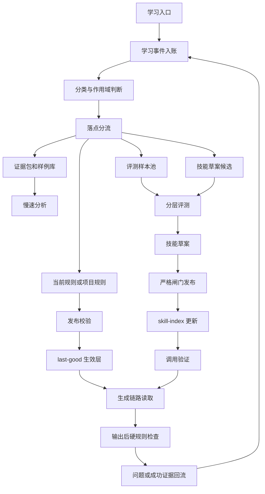

# 自主学习机制闭环重构方案

状态：主窗口讨论稿  
日期：2026-07-04  
适用范围：对话学习、样例投喂、自动检测、画布归档、当前规则层、技能进化和学习资料库

## 一、文档目的

本文用于统一最新一轮关于“学习机制闭环”的讨论结论，避免继续在旧 M0-M6 文档、技能说明、学习记录和页面补丁之间分散推进。

本文不是直接开发计划。后续开发前，应先在主窗口确认本文的业务闭环、状态定义、数据落点和用户可见表达。

本文要解决的核心问题：

1. 学习入口很多，但入账、分类、落点、生效、评测、技能进化之间没有完整闭环。
2. 当前规则层已经能承接一部分明确规则，但不能承接所有学习结果。
3. 画布归档目前更接近冻结存档，没有真正转化为成熟学习证据。
4. 技能进化目前偏草案和建议，没有形成安全发布与调用验证闭环。
5. 学习资料库展示的信息不足，用户难以判断“到底学到了哪里”。

## 二、核心原则

1. 用户创作流程不能被学习流程卡住。学习失败、排队、评测失败、技能草案失败，都不能阻塞对话、画布编辑、剧本生成和分镜生成。
2. 正常生成链路只读取当前生效层，不实时扫描学习事件账本。
3. 学习事件账本只做追加留痕，不物理覆盖，不直接参与实时生成。
4. 学习不等于全部写入 skill。很多学习只应停留在当前规则、项目规则、样例库或评测样本池。
5. 当前规则层可以自动生效，但必须通过结构、冲突和加载校验。
6. skill 或小技能必须走严格闸门，不能因为单条反馈或单个归档项目直接发布。
7. 归档代表当前项目最终可用，不等于全局方法论成立。
8. 作用域判断先于生效判断。无法判断作用域时，不应默认污染全局。
9. 用户可见页面使用简单语言，不暴露 M0-M6、topicKey、M4 等内部术语。
10. 学习资料库只读查看。用户纠错、补充、调整学习结果，应回到正常对话或创作页面触发。

## 三、用户可见概念

学习页面建议统一命名为“学习资料库”。页面只读，不作为规则编辑器。

用户主要看到五类内容：

| 页面区域 | 用户理解 | 展示重点 |
| --- | --- | --- |
| 学习记录 | 系统听到并处理过什么 | 时间、来源、状态、学到的摘要、落实位置、失败原因 |
| 当前生效 | 现在会影响生成的规则 | 全局规则、项目规则、适用范围、来源 |
| 样例归档 | 已入库的成熟样例和归档结果 | 项目、画布、最终版本、可学习价值 |
| 评测记录 | 系统如何判断学习是否有效 | 检查项、结果、失败原因、关联规则或技能草案 |
| 技能库 | 系统当前具备哪些能力 | 技能说明、适用场景、是否基础技能或派生技能 |

用户侧状态保持简化：

- 处理中
- 已生效
- 已被覆盖
- 失败

说明：

- “已生效”必须同时展示落实位置，例如“当前规则”“项目规则”“样例库”“评测样本”“技能草案”“正式技能”。
- “已生效”不一定代表已经改变生成结果。比如样例入库属于学习结果已落地，但只有被整理成规则、项目记忆或技能后，才会影响生成。
- 不使用“已忽略”作为用户状态。低价值或不采用的内容可以在详情里说明“未进入生效层”，但不作为主状态打扰用户。

### 用户可见表达

学习资料库的详情页不向用户暴露 `topicKey`、L0/L1/L2、`skill-index` 等内部术语。用户只需要看懂五件事：

1. 学到了什么。
2. 从哪里学到。
3. 用在哪里。
4. 是否会影响后续生成。
5. 如果学错了，应该如何纠正。

每条学习记录详情必须显示：

```text
状态：已生效
落实位置：项目规则
是否影响生成：会，仅影响当前项目
来源：画布归档
证据：最终剧本 v2、分镜 v3、用户采纳清单
```

如果学习结果只是进入样例库或评测样本池，应明确写成：

```text
状态：已生效
落实位置：样例库
是否影响生成：暂不影响生成
说明：后续只有整理成规则、项目记忆或技能后，才会影响生成。
```

因此，“已生效”只能表示学习结果已经落到某个位置，不能单独表达“生成时一定会用”。

## 四、内部对象分层

学习结果必须先分层，再决定是否影响生成。

| 内部对象 | 作用 | 是否直接影响生成 | 典型来源 |
| --- | --- | --- | --- |
| 学习事件 | 原始触发记录 | 否 | 对话、归档、样例、校验、用户纠错 |
| 证据包 | 可追溯材料集合 | 否 | 归档画布、满意样例、修正前后对比 |
| 当前规则 | 长期或近期生效的规则 | 是 | 明确规则、稳定纠错 |
| 项目规则 | 当前项目或客户范围内的偏好 | 是，但有作用域 | 项目偏好、客户格式、单剧风格 |
| 样例库 | 可参考的成熟样例 | 默认否 | 用户投喂、画布归档 |
| 评测样本池 | 用于验证规则和技能是否变好 | 否 | 归档、样例、修正结果 |
| 技能草案 | 可能修改 skill 的候选方案 | 否 | 多证据归纳、评测通过建议 |
| 正式 skill | 能力入口和方法论 | 是 | 严格闸门发布 |
| skill-index | 派生技能和技能路由索引 | 是，决定是否能被调用 | 技能发布流程 |

关键边界：

- 学习事件不是规则。
- 证据包不是规则。
- 样例库不是规则。
- 归档不是全局规则。
- 技能草案不是正式 skill。
- skill 文件存在不等于生成链路已经调用。

## 五、学习入口与默认落点

| 入口 | 默认通道 | 默认落点 | 是否可快速生效 |
| --- | --- | --- | --- |
| 用户明确规则 | 快速通道 | 当前规则或项目规则 | 可以 |
| 用户反复纠错 | 快速加慢速 | 学习事件、候选规则、证据 | 视稳定性 |
| 用户投喂样例 | 慢速通道 | 样例库、评测样本池、证据包 | 不直接生效 |
| 画布归档 | 慢速通道 | 成熟证据包、样例库、评测样本池 | 不直接改 skill |
| 自动检测失败 | 慢速通道 | 问题证据、回归线索 | 不直接生效 |
| 用户修正问题 | 快速加慢速 | 纠错事件、规则收窄、正向证据 | 视类型 |
| 用户说学错了 | 快速通道 | 降质或纠错事件、覆盖候选 | 可以收窄或覆盖 |
| 多次跨项目有效 | 慢速通道 | 技能草案、派生技能候选 | 不能直接发布 |

## 六、作用域判断

学习事件必须带作用域。推荐作用域从小到大：

1. 本轮对话
2. 当前画布
3. 当前项目
4. 当前客户或使用者
5. 全局

默认规则：

- 明确硬性交付规则，且与系统标准一致，可以进入全局当前规则。例如“分镜台词每句 20 字以内”。
- 风格偏好、表达偏好、题材偏好，第一阶段默认进入项目规则，不进入全局；客户规则后置。
- 单个归档项目只证明该项目成熟，不证明全局成立。
- 样例质量未知、来源不清、项目归属不清时，只进入学习记录或样例观察区。
- 判断不准时不覆盖旧规则，不发布全局规则。

### 项目规则生命周期

第一阶段先做“项目规则”，不单独做客户级规则。客户级规则等产品出现明确客户账号或客户空间后再引入。

默认判断：

- 用户说“这个项目以后都这样”“这部剧保持这个风格”，进入项目规则。
- 用户只说“以后都这样”，如果不是硬性交付规则，默认先进入当前项目规则。
- 用户明确说“所有项目以后都这样”，且规则可执行、低风险、与系统标准不冲突，才进入全局当前规则候选。
- 明确硬性交付规则，且符合系统通用标准，可以进入全局当前规则。例如分镜字段完整、台词长度限制、镜号连续性。

加载优先级：

```text
当前对话临时要求
-> 项目规则
-> 全局当前规则
-> 基础 skill
```

约束：

- 项目规则可以收窄全局规则，但不能静默放宽硬性交付底线。
- 项目规则只影响所属项目、画布或运行，不影响其他项目。
- 项目归档后，项目规则保留为证据，不自动晋升全局规则。
- 多个项目重复出现同类项目规则，才进入全局规则或技能草案候选。
- 用户说“这条只适用于当前项目”时，如果此前已有全局规则，应生成收窄或覆盖事件，不能只写备注。

## 七、落点分流规则

每条学习事件入账后，应先判断落点。

```text
学习事件
  -> 是否明确、可执行、低风险
       是 -> 当前规则或项目规则候选
       否 -> 继续判断
  -> 是否是最终稿、满意稿或归档稿
       是 -> 证据包、样例库、评测样本池
       否 -> 继续判断
  -> 是否是反复纠错或质量下降
       是 -> 纠错事件、降质事件、回归评测线索
       否 -> 继续判断
  -> 是否形成跨项目稳定方法论
       是 -> 技能草案候选
       否 -> 只保留学习记录
```

不得直接发布的情况：

- 单个项目的题材规则。
- 未确认质量的样例。
- 用户只是临时要求。
- 与已有规则冲突但未评测。
- 无法判断作用域。
- 自动归纳出来但没有证据链。

### 待观察和重入规则

“只保留学习记录”不是终点。证据不足但可能有价值的内容，应进入待观察状态。

进入待观察的典型情况：

- 用户表达了偏好，但没有说明是否长期有效。
- 样例质量不确定，暂时无法判断是否可学。
- 同类问题只出现一次。
- 与现有规则可能冲突，但证据不够。
- 作用域无法判断。

待观察内容满足以下任一条件时，必须重新进入分类与落点分流：

- 同一 `topicKey` 和同一作用域下再次出现相似反馈。
- 后续画布归档或样例入库提供了证据。
- 用户明确确认“这个以后都要这样”。
- 自动检测或评测发现同类问题重复出现。
- 用户纠正“之前那条学错了”并指向相关记录。

待观察记录在学习资料库中不应打扰用户，但详情中要显示“未进入生效层”和等待的证据类型。

## 八、完整闭环流程



闭环成立的条件：

1. 每个入口都能入账。
2. 每个事件都能找到落点。
3. 每个落点都有下一步或终态。
4. 每个生效结果都能追溯证据。
5. 每个失败都有原因。
6. 每个覆盖都有覆盖关系。
7. 每个正式 skill 发布后都验证能被调用。

### 闭环状态机

每条学习事件必须进入明确状态，不能只停留在“记录已生成”。

| 状态 | 含义 | 下一步 | 用户可见表达 |
| --- | --- | --- | --- |
| 已入账 | 已保存原始触发 | 分类与作用域判断 | 处理中 |
| 已分类 | 已判断来源、能力域、作用域 | 落点分流 | 处理中 |
| 待观察 | 有学习价值但证据不足 | 等待重复证据、归档证据或用户再次纠错 | 未进入生效层 |
| 已落地 | 已进入当前规则、项目规则、样例库、评测样本或技能草案 | 校验、评测或等待使用 | 已生效，并显示落实位置 |
| 已验证 | 通过对应校验或评测 | 进入生成链路或发布流程 | 已生效 |
| 已进入生成链路 | 生成时会读取 | 输出后检查与证据回流 | 已生效，会影响生成 |
| 已被覆盖 | 被同主题新事件替代或收窄 | 保留证据，不再影响生成 | 已被覆盖 |
| 失败 | 入账、分类、发布、评测或加载失败 | 重试、等待纠错或终止 | 失败，并显示原因 |

状态约束：

- 待观察不是终态，必须能被重复反馈、归档证据、评测结果或用户确认重新唤醒。
- 已落地不等于一定影响生成。只有当前规则、项目规则、正式 skill 和可调用小技能才影响生成。
- 已进入生成链路后，输出必须进入硬规则检查或人工采纳回流，否则学习闭环没有闭合。

## 九、快速通道

快速通道用于明确规则，目标是让下一次生成尽快受益。

适用：

- 用户明确说“以后”“默认”“必须”“不要再”。
- 规则可执行、低风险、可表达为一句规则。
- 最好可被程序校验或人工清楚判断。

流程：

1. 入账为学习事件。
2. 判断能力域、作用域和规则类型。
3. 生成规则卡。
4. 执行结构校验、冲突校验、加载校验。
5. 写入当前规则或项目规则。
6. 发布为 last-good。
7. 学习资料库显示“已生效”，并展示落实位置。

注意：

- 本轮对话可以先按用户上下文执行。
- 不能在发布成功前告诉用户“已长期记住”。
- 发布失败必须显示失败原因，并通知用户查看。

## 十、慢速通道

慢速通道用于样例投喂、归档学习、复杂纠错、技能进化。

原则：

- 不阻塞创作。
- 不临时影响生成。
- 不直接扫描事件账本参与生成。
- 可以后台排队、重试和续跑。

慢速任务类型：

| 任务 | 输入 | 输出 |
| --- | --- | --- |
| 样例分析 | 用户投喂材料 | 样例条目、证据包、评测建议 |
| 归档分析 | 归档画布 | 成熟证据包、评测样本、规则候选 |
| 纠错归纳 | 反复纠错事件 | 规则收窄、覆盖建议、回归任务 |
| 评测执行 | 规则或技能候选 | 评测结果 |
| 技能草案 | 多证据和评测结果 | skill 修改草案或小技能草案 |

### 慢速分析出口

样例投喂、画布归档、复杂纠错进入慢速分析后，必须输出以下终态之一：

| 输出 | 含义 | 后续动作 |
| --- | --- | --- |
| 仅归档 | 有参考价值，但暂不形成规则 | 留在样例库或证据包，等待后续重复命中 |
| 生成评测任务 | 可用于检查规则或技能是否变好 | 进入评测样本池 |
| 生成规则候选 | 可表达为当前规则或项目规则 | 进入发布校验 |
| 生成技能草案候选 | 形成稳定方法论或流程变化 | 进入 L1/L2 评测和人工确认 |
| 标记不可学习 | 质量差、来源不清或用户否定 | 保留证据，不进入生效层 |

慢速分析不能只生成报告。报告必须附带落点、下一步和终态判断。

## 十一、画布归档学习

画布归档不是删除，也不是直接全局学习。

归档后必须生成成熟证据包。建议字段：

| 字段 | 说明 |
| --- | --- |
| archiveId | 归档证据包编号 |
| canvasId | 来源画布 |
| projectId | 所属项目 |
| archivedAt | 归档时间 |
| finalNovelNodeId | 最终小说节点，可为空 |
| finalScriptNodeId | 最终剧本节点 |
| finalStoryboardNodeIds | 每集最终分镜节点 |
| episodeMap | 剧本集数和分镜集数对应关系 |
| userEdits | 用户修改链路摘要 |
| validationResults | 归档前检查结果 |
| currentRulesUsed | 当时命中的当前规则 |
| projectRulesUsed | 当时命中的项目规则 |
| acceptedIssues | 用户选择“仍然采用”的问题 |
| fixedIssues | 用户已修正的问题 |
| sourceSnapshot | 最终文本快照或引用路径 |

重要规则：

- 有些使用场景没有小说，直接从剧本开始，归档判定不能强制要求小说。
- 归档只能证明当前项目成熟。
- 归档证据可以进入样例库和评测样本池。
- 归档证据经过多次跨项目验证后，才可能推动 skill 草案。
- “仍然采用”不是正向学习证据，只表示用户接受当前结果，不应直接强化错误规则。

## 十二、分层评测

评测不能一刀切，否则会拖慢学习队列。

| 层级 | 名称 | 用途 | 成本 | 触发场景 |
| --- | --- | --- | --- | --- |
| L0 | 硬规则校验 | 判断明确规则是否满足 | 低 | 台词长度、字段完整、集数识别 |
| L1 | 小样本回归 | 判断规则或草案是否破坏典型样例 | 中 | 当前规则升级、重要项目规则 |
| L2 | 深度风格评测 | 判断方法论或 skill 草案是否整体变好 | 高 | skill 修改、小技能创建 |

示例：

- “台词每句 20 字以内”先走 L0。
- “运动镜头占比 30% 到 40%”可走 L0 加 L1。
- “某类剧本评审要更细化人物动机”应走 L1 或 L2。
- “根据归档项目总结出新的分镜方法论”必须走 L2，不能直接写 skill。

### 评测结果与动作

评测结果必须驱动动作，不能只保存为报告。

| 结果 | 含义 | 动作 |
| --- | --- | --- |
| 通过 | 规则或草案改善明确 | 允许发布、晋升或继续使用 |
| 未通过 | 破坏已有样例或未满足硬规则 | 阻断发布，记录失败原因 |
| 不确定 | 样本冲突或判断不足 | 进入待观察，不发布 |
| 样本不足 | 缺少可用样例 | 生成待补样例任务或归档需求 |
| 回归失败 | 已生效内容导致退步 | 生成纠错事件和回滚 / 收窄建议 |

最低要求：

- 当前规则或项目规则发布前，至少通过结构校验、冲突校验和加载校验。
- 明确硬性交付规则必须绑定 L0 输出后校验。
- 重要项目规则如果可能影响风格、结构或镜头方法，应补 L1 小样本回归。
- 技能草案必须至少通过 L1；涉及方法论变化、跨技能边界或小技能创建时，必须走 L2。
- 已生效规则在评测中失败时，不直接删除，而是生成纠错事件、覆盖建议或回滚建议。

## 十三、skill 晋升与发布

skill 是能力入口和方法论，不是所有学习的终点。

可以进入 skill 草案的条件：

1. 不是单条规则，而是稳定方法论或流程变化。
2. 有多条学习事件或多个样例支持。
3. 至少跨项目或跨场景验证，除非明确是派生小技能。
4. 有评测结果显示改善。
5. 不与基础 skill 的边界冲突。

不得进入 skill 的情况：

- 单项目特殊偏好。
- 单个客户临时要求。
- 单条硬规则即可解决的问题。
- 样例质量未知。
- 尚未通过评测。
- 会破坏已有生成链路。

skill 发布流程：

```text
技能草案
  -> 证据链检查
  -> 评测结果检查
  -> 生成 diff 或新小技能草案
  -> 备份原 skill
  -> 应用修改
  -> 验证 skill 能加载
  -> 更新 skill-index
  -> 验证路由命中
  -> 运行 smoke 生成
  -> 输出后校验
  -> 发布成功或回滚
```

发布成功不等于闭环完成。必须完成调用验证：

- 相关请求能命中正确基础 skill 或小技能。
- 生成前能加载当前规则和必要 skill。
- 输出后能通过对应硬规则检查。
- 学习资料库能展示该技能的说明、来源证据和发布记录。

## 十四、生成链路

生成链路建议固定为：

```text
任务路由
  -> 基础 skill
  -> 当前规则和项目规则
  -> 必要小技能
  -> 生成
  -> 硬规则检查
  -> 问题或成功证据异步回流
```

生成链路禁止：

- 实时扫描全部学习事件。
- 临时处理 queued 学习任务。
- 读取未发布的技能草案。
- 因学习失败中断用户生成。

## 十五、覆盖、纠错和学坏处理

覆盖必须判断关系：

| 关系 | 处理 |
| --- | --- |
| 补充 | 不覆盖，合并或并列 |
| 收窄 | 新规则覆盖旧规则 |
| 替换 | 新规则覆盖旧规则 |
| 冲突 | 进入评测或等待确认，不盲目覆盖 |
| 无关 | 不覆盖 |

用户说“学错了”“不要这样学”“这条只适用于当前项目”时：

1. 生成纠错事件。
2. 找到关联规则、样例、技能草案或评测任务。
3. 如果是当前规则，生成收窄或覆盖规则。
4. 如果是技能草案，暂停晋升。
5. 如果已经发布 skill，进入回归评测和技能修正草案。
6. 保留旧事件，不物理删除。

关联查找必须依赖结构化字段，不能只靠文本搜索。学习事件和所有落点至少保留：

- `sourceEventIds`
- `projectId`
- `canvasId`
- `conversationId`
- `outputId`
- `topicKey`
- `scope`
- `landingIds`

如果无法定位关联对象，纠错事件不得直接覆盖规则，应先进入待观察，并在详情中标注“等待用户确认”。

## 十六、失败、重试和停滞处理

失败不能只显示“失败”，必须记录原因。

失败信息至少包含：

- eventId
- sourceType
- stage
- errorCode
- errorMessage
- retryCount
- nextRetryAt
- tokenUsage
- lastGoodVersion
- affectedOutput
- 是否影响创作
- 是否已被覆盖

重试策略：

| 类型 | 策略 |
| --- | --- |
| 网络超时 | 自动重试 |
| 模型接口临时失败 | 自动重试 |
| 文件占用 | 自动重试 |
| 预算暂时不足 | 排队等待 |
| JSON 结构错误 | 直接失败 |
| 冲突无法判断 | 直接失败或等待对话纠错 |
| 发布后加载失败 | 直接失败并保留 last-good |

停滞处理：

- 后台任务超过预期时间，应进入“处理中”的停滞详情。
- 超过最大等待时间后，自动转为失败或等待重试。
- 被同主题新事件覆盖的 pending、retrying、processing 任务必须立即失去发布权。
- 如果模型请求无法中断，返回后也必须丢弃结果。

### 发布权和任务锁

后台任务不能只靠状态字段判断能否发布。每个可能写入当前规则、项目规则、评测结果或技能草案的任务，都必须带发布权字段：

- `jobId`
- `topicKey`
- `scope`
- `publishToken`
- `expectedVersion`
- `supersededByJobId`
- `status`

发布前必须二次检查：

1. 当前任务仍是同主题、同作用域下最新有发布权的任务。
2. `expectedVersion` 仍匹配目标文件版本。
3. 没有被更新事件标记为 `supersededByJobId`。
4. 发布后能通过加载校验。

如果检查失败，任务结果只能作为证据保留，不能写入生效层。

## 十七、学习资料库详情页

学习记录详情建议展示：

1. 原始触发内容。
2. 来源位置：对话、画布、归档、样例、自动检测。
3. 分类结果。
4. 作用域。
5. 落实位置。
6. 生成的规则、样例、评测任务或技能草案。
7. 失败原因和处理日志。
8. 覆盖关系。
9. token 消耗。

技能库详情建议展示：

1. 技能名称。
2. 技能用途。
3. 适用场景。
4. 当前是否可用。
5. 基础技能或派生技能。
6. 关联规则。
7. 最近一次发布记录。
8. 相关评测结果。

不建议在学习资料库提供复杂编辑按钮。  
纠错入口仍然是正常对话，例如：

- “刚才那条不要那样学。”
- “这条只适用于当前项目。”
- “以后不要把这种样例当成全局规则。”

## 十八、建议存储结构

第一阶段建议继续使用文件型结构，避免一开始引入数据库复杂度。

```text
learning/
  events.jsonl
  current-ruleset.json
  project-rules/
    <projectId>.json
  evidence/
    archive-bundles/
      <archiveId>.json
    correction-bundles/
      <eventId>.json
  samples/
    index.jsonl
  evals/
    tasks/
    results.jsonl
  skill-drafts/
    <draftId>.md
    <draftId>.json
  skill-index.json
  jobs.jsonl
```

核心文件约束：

- `events.jsonl` 是追加账本，记录原始触发、分类结果、作用域、落点和状态变化。
- `current-ruleset.json` 只保存全局或稳定规则。
- `project-rules/<projectId>.json` 保存当前项目偏好和项目级约束。
- `evidence/archive-bundles/` 保存归档成熟证据包。
- `evals/results.jsonl` 保存 L0/L1/L2 评测结果和动作建议。
- `jobs.jsonl` 保存后台任务、重试、停滞、覆盖和发布权信息。

后续如果学习记录、队列和评测结果明显变多，再考虑迁移到 SQLite。迁移前不要把数据库作为第一阶段阻塞点。

## 十九、旧资产迁移原则

已有资产包括：

- `learning/accepted-rules/`
- `learning/candidate-rules/`
- `learning/conversation-records/`
- `learning/evals/`
- `learning/regression-reports/`
- `learning/snapshots/`
- `learning/skill-evolution-reports/`

迁移原则：

1. 先作为只读历史证据索引。
2. 不批量导入当前规则。
3. `accepted-rules` 可以作为种子候选，但仍需结构、冲突和加载校验。
4. `candidate-rules` 不能直接生效。
5. 旧评测结果可以作为参考，但要标明时间和适用范围。
6. 旧技能进化草案不等于当前要发布的 skill 变更。

## 二十、实施顺序建议

不建议继续先改页面细节。建议按闭环骨架推进。

### P0：确认本文档

- 在主窗口讨论并确认本文。
- 修正概念、状态、落点和作用域。
- 明确哪些第一阶段做，哪些后置。

### P1：统一学习事件账本

- 所有入口统一入账。
- 增加分类、作用域、落点、内部阶段和失败详情。
- 增加状态机、待观察重入和结构化关联字段。
- 学习资料库先能完整展示事件。

### P2：重构当前规则和项目规则

- 当前规则保留全局或稳定规则。
- 项目规则承接项目偏好和当前使用场景偏好。
- 生成链路按作用域加载规则。
- 第一阶段不做客户级规则；客户级规则后置。

### P3：补归档成熟证据包

- 归档后冻结画布。
- 生成成熟证据包。
- 进入样例库和评测样本池。
- 不直接改 skill。
- 慢速分析必须输出落点、下一步和终态。

### P4：补 L0 和 L1 评测

- 先实现低成本硬规则检查。
- 再实现小样本回归。
- 评测结果必须驱动发布、阻断、待观察或回滚建议。
- L2 深度风格评测后置。

### P5：补技能草案和发布验证

- 生成技能草案和 diff。
- 记录证据链和评测结果。
- 发布后验证路由命中、加载和输出检查。

### P6：重构学习资料库

- 用用户能理解的页面替代内部术语。
- 展示状态、落点、失败原因和证据链。
- 每条记录必须展示“是否影响生成”。
- 保持只读，不做规则编辑后台。

## 二十一、主窗口待确认问题

本文建议第一阶段先锁定以下默认决策：

1. “以后都这样”默认进入项目规则；只有明确硬性交付规则或用户明确全局化，才进入全局当前规则候选。
2. 第一阶段项目规则合并在“当前生效”中展示，不单独做复杂规则后台。
3. 技能草案发布必须保留人工确认闸门，不做评测通过后自动改 skill。
4. 样例库第一阶段主要用于证据和评测，不默认参与生成前检索。
5. 学习资料库中“已生效”必须同时展示落实位置和是否影响生成。
6. 客户级规则后置，当前只做项目规则。
7. 当前版本继续文件型存储，暂不引入 SQLite。

仍需主窗口继续确认的问题：

1. L1 小样本回归第一批样本从哪些归档或历史样例中选。
2. 学习资料库是否把“评测记录”做成独立 Tab，还是先放在学习记录详情中。
3. 项目规则是否需要支持手动停用；如果支持，入口放在对话纠错还是学习资料库详情。

## 二十二、第一阶段验收标准

第一阶段不以“自动创建 skill”为验收标准。第一阶段应先证明学习闭环骨架成立。

验收用例：

1. 用户明确提出硬规则，系统能入账、发布当前规则、生成时读取、输出后校验。
2. 用户提出项目偏好，系统能进入项目规则，不污染全局。
3. 用户投喂样例，系统能入账并落到样例库或评测样本池，不直接发布规则。
4. 用户归档画布，系统能生成成熟证据包。
5. 用户说“学错了”，系统能产生纠错事件并覆盖或收窄相关规则。
6. 自动检测发现问题，系统能把问题和用户处理结果回流为证据。
7. 学习任务失败，用户能看到失败阶段和原因。
8. 学习任务卡住，系统能超时转为失败或等待重试。
9. 同主题新事件覆盖旧事件时，旧任务失去发布权。
10. 学习资料库能展示每条学习的来源、状态、落点和证据。
11. 证据不足的学习记录能进入待观察，并能被重复反馈或归档证据重新唤醒。
12. 慢速分析不会只生成报告，必须输出落点、下一步和终态。
13. 评测结果能驱动发布、阻断、待观察或回滚建议。
14. “已生效”的样例库记录能明确显示暂不影响生成，避免用户误解。
15. 后台任务发布前会校验发布权，旧任务不能覆盖新结果。

第二阶段再验收：

1. 多条规则和归档证据能生成技能草案。
2. 技能草案能跑 L1 或 L2 评测。
3. 发布后能更新 skill-index。
4. 路由能命中新技能或修改后的技能。
5. 输出能通过对应校验。
6. 发布失败能回滚。

## 二十三、当前判断

当前项目已有一些基础：

- 学习事件账本雏形。
- 当前规则层雏形。
- 对话学习记录。
- 样例学习和技能进化相关 skill。
- M4 评测任务和技能进化草案历史资产。
- 画布归档冻结能力。
- 分镜硬规则检查雏形。

但这些还没有组成完整闭环。下一步不应继续零散堆功能，而应先按本文确认学习闭环骨架，再拆分实现。
