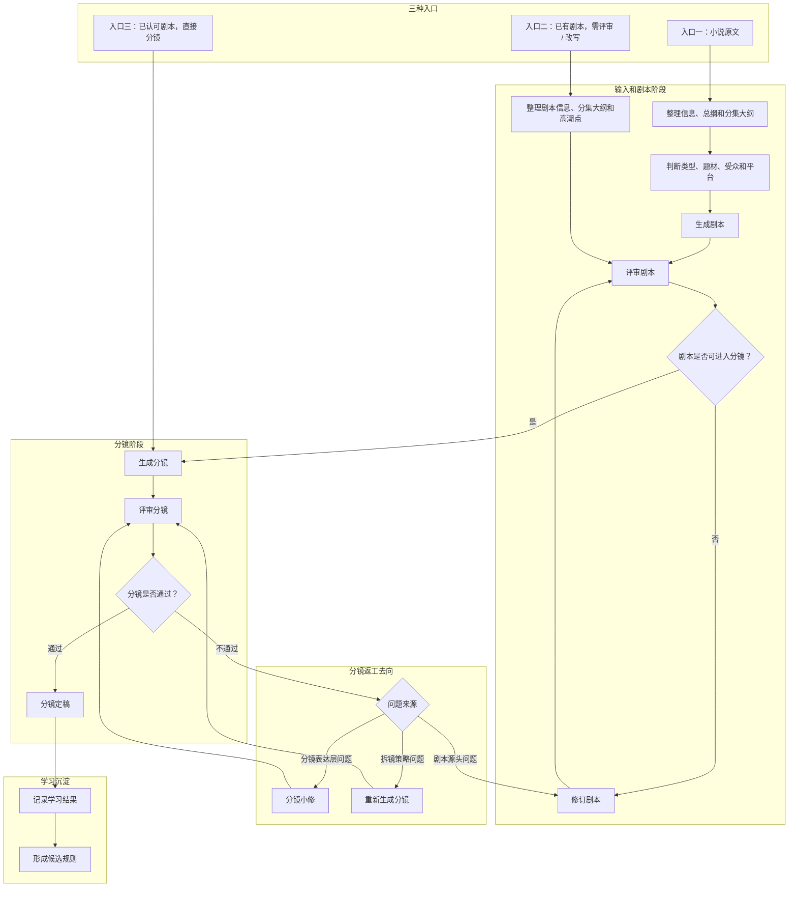

# 项目说明

当前系统版本：`0.5`。

版本定位：当前版本是学习机制半成品阶段。只有学习机制闭环完整、可查看、可校验、可回退并稳定服务剧本 / 分镜生成后，才进入完整 `1.0` 版本。

## 一、项目目的

本项目用于把小说文本改编成 **AI漫剧剧本**，再把剧本转成 **AI漫剧分镜**。

它不是通用写作助手，也不是个人知识库。它是一个聚焦的 AI 漫剧创作生产助手，核心产物只有两个：

1. **AI漫剧剧本**：把小说内容整理成适合 AI 漫剧节奏的场景、对白、旁白、动作和情绪节拍。
2. **AI漫剧分镜**：把剧本整理成适合 AI 画面生成和视频生成的镜头、画面、景别、动作、音效和字幕节拍。

## 二、交付定位

这个项目是给别人使用的本地 AI 漫剧剧本分镜小助手，当前名称为“猫主子漫剧剧本分镜小助手”，而不是只服务当前对话的一次性方案。

因此它需要具备三种长期能力：

1. **可复用**：不同小说、不同剧本都能按稳定流程处理。
2. **可学习**：用户投喂的剧本、分镜、修改意见能沉淀成规则。
3. **可进化**：技能可以根据真实使用持续改进，但不能无证据乱改。

学习应尽量无感发生：使用人员只需要正常提供小说、剧本、分镜或修改意见。系统在使用过程中自动沉淀扫描报告、评测任务草案、学习快照和对话学习记录；只有关键关系无法判断时，才向使用人员提出简短问题。普通问答不强行学习，后续对话中出现新偏好、流程要求、样例解释或质量反馈时，系统应在对话结束前自行判断是否记录。用户主动点击“技能学习”并明确要求学习时，不再额外要求二次确认，而是由总控调用原版 skill-creator 生成修改结果，校验通过后写入对应正式 `SKILL.md`；不得把用户原话直接粘贴进 skill。复杂新技能创建或大范围重构，也同样由总控调用原版 skill-creator。

同时，学习必须可止损。若用户反馈学习后输出质量下降，系统应记录降质原因、暂停强化可疑规则，并通过“带引用去纠正”形成覆盖、收窄或停用说明。主动技能学习经 skill-creator 修改正式 skill 后会被后续生成读取，因此必须保留来源记录、写入文件和回退入口；历史 skill-creator 任务不再代表当前技能学习按钮的默认行为。

## 三、当前执行状态

当前项目已完成第一批本地技能、样例整理和三条业务链路试跑，M4：评测和进化已经启动。

最新执行文档：

- [当前里程碑节点](当前里程碑节点.md)
- [M3三条链路验收记录](M3三条链路验收记录.md)
- [M5自主学习闭环阶段记录](M5自主学习闭环阶段记录.md)

学习、评测、历史技能进化草案和历史 skill-creator 任务属于本机沉淀数据，不进入公开仓库；正式 skill、references、scripts、assets 属于可随产品打包的能力资产。

## 四、产品边界

### 第一版包含

- 输入或粘贴小说文本。
- 判断小说类型、题材、语气、受众和改编目标。
- 生成 AI 漫剧剧本草稿，包括场景结构、对白、旁白、动作、情绪节奏和改编说明。
- 生成 AI 漫剧分镜草稿，包括镜头顺序、画面描述、景别、角色动作、对白或旁白对应、音效、字幕和制作备注。
- 保存用户反馈和评审结果，让后续同类型小说改编越来越稳定。
- 用项目分组管理多个剧目、多个对话和相关工作。
- 用画布把小说、剧本、分镜脚本和备注组织成可视化节点，并支持从小说节点生成剧本、从剧本节点按集数生成分镜脚本。

### 第一版不包含

- 视频成片渲染。
- 配音生成。
- 最终画面生成。
- 多人协作。
- 发布自动化。
- 完整版权管理。

## 五、应用场景

本项目目前有三种明确应用场景。

这三种场景默认都面向 AI 漫剧生产。除非用户明确说明，否则剧本评审、分镜生成和样例学习都以“适合 AI 漫剧生成”为判断标准，而不是以传统影视拍摄、广播剧或纯文字小说续写为判断标准。

### 场景一：小说生成剧本，再由剧本生成分镜

适合用户只有小说原文，尚未整理剧本的情况。

流程：

```text
小说输入
-> 输入整理
-> 类型和题材判断
-> 生成剧本草稿
-> 调整剧本
-> 剧本定稿
-> 生成分镜
-> 分镜评审
```

关键点：

- 剧本不是一次性最终答案，要允许调整。
- 分镜必须基于调整后的剧本生成。
- 学习记录要同时记录“原始剧本”和“调整后剧本”的差异。
- 如果在画布中操作，小说节点可以直接生成剧本节点；剧本节点再按分集标题生成对应分镜脚本节点。

### 场景二：提供剧本，先评审改写，再生成分镜

适合用户已经有剧本，但剧本质量、节奏或可拍性还不稳定的情况。

流程：

```text
剧本输入
-> 剧本结构分析
-> 剧本评审
-> 剧本改写建议
-> 剧本修订
-> 生成分镜
-> 分镜评审
```

关键点：

- 先判断剧本是否适合直接进入分镜。
- 改写应保留原剧本意图，不随意重写成另一个故事。
- 分镜应使用修订后的剧本，而不是原始剧本。

### 场景三：直接提供剧本，生成分镜

适合用户已经认可剧本，只需要分镜的情况。

流程：

```text
剧本输入
-> 分场和节拍识别
-> 生成分镜
-> 分镜评审
```

关键点：

- 不主动大改剧本。
- 只在发现剧本缺口影响分镜时提出问题。
- 分镜重点是画面、景别、动作、转场和可拍性。

## 六、选择性借鉴边界

### 画布和项目管理边界

项目分组只用于本机工作管理：把同一剧目、同一客户或同一批任务下的对话收拢在一起。它不改变单个对话窗口的上下文边界，也不把不同项目的内容自动混合学习。

画布是创作材料的可视化工作区，不替代技能本身。画布负责保存节点、连线、位置和用户可见的材料关系；真正生成剧本和分镜时，仍由后端程序调用模型，并结合现有技能规则完成。当前画布的核心自动化链路是：

```text
小说节点
-> 生成剧本节点
-> 识别剧本分集
-> 按集生成分镜脚本节点
```

画布数据保存在 `app/data/canvases/`，属于本机运行数据。客户打包和公开 Git 仓库不应包含维护人员本机已有的画布数据。

前端所有可能超过 1 秒的请求型操作都必须提供可见等待反馈。画布中的模型生成、节点修改、批量分镜、归档检查等动作不能只显示静态文字或静默等待，应使用遮罩层、局部 busy 层、按钮禁用或请求中动画，让用户明确知道当前系统仍在处理。

本项目会参考 `0WcAssistant` 的部分既有讨论，但不会把它的个人驾驶舱方向搬过来。

`0WcAssistant` 是个人知识库和中枢驾驶舱。本项目更窄：它只服务小说改编成剧本和分镜。

因此，以下方向不复制到本项目：

- 中枢首页
- 跨模块个人助理
- 今日摘要
- 广义个人知识库
- 无关业务模块注册
- 完整模块接入协议

可借鉴的部分是：

- 技能先放在本地项目里沉淀。
- 按职责组织技能，不写成一个巨大的提示词。
- 让真实重复动作决定哪些技能值得正式化。
- 保留每次运行的产物和反馈，让后续工作有记忆。

## 七、参考项目带来的设计

### 从 `gstack` 借鉴

本项目应该像一个小型创作团队，由多个职责明确的技能组成：

- 输入整理：理解小说原文和改编限制。
- 类型判断：选择合适的改编规则。
- 剧本生成：产出场景化剧本。
- 剧本评审：检查节奏、忠实度、冲突和平台适配。
- 分镜生成：把剧本转成视觉节拍。
- 连贯性评审：检查镜头顺序、角色连续性和过渡缺口。

核心思想是：前一步产物必须交给后一步使用。比如剧本评审不能只是一个报告，它必须影响后续分镜生成。

### 从 `gbrain` 借鉴

本项目应该建立一个很小但有用的任务记忆层。每次运行可以保存：

- 原文信息
- 类型和题材判断
- 使用的技能版本
- 剧本草稿
- 分镜草稿
- 用户修改
- 评审发现
- 学习记录
- 评测样例

如果反复使用后发现某类小说总是开头弱、对白平、分镜不可拍，就把问题变成候选规则、示例或评测样例。

技能修改需要经过审查。系统可以提出改进建议，但不应该因为一次运行就静默改掉正式技能。

## 八、自主学习目标

本项目的“自主学习”不是让系统随意改写自己，而是让系统在使用中形成可审查的经验沉淀。

学习来源：

- 已有剧本和分镜样例。
- 用户修改前后的差异。
- 用户明确说“这样好 / 这样不好”的反馈。
- 每次运行的评审结果。
- 评测样例的通过和失败记录。

学习结果：

- 候选规则。
- 用户偏好。
- 类型题材规则。
- 分镜格式规则。
- 技能改进建议。

正式技能只有在有证据、有评测、有确认时才更新。

## 九、核心流程



## 十、分镜评审闭环

分镜评审不是终点。分镜不达标时，必须判断问题来源，再决定回到哪一步。

```text
生成分镜
-> 评审分镜
-> 判断问题来源
   -> 表达层小问题：分镜小修
   -> 拆镜问题较多：重新生成分镜
   -> 剧本源头问题：返回剧本评审 / 改写
```

### 1. 分镜小修

适用于问题只发生在分镜表达层，例如：

- 个别镜头景别不合适。
- 运镜缺失。
- 音效、台词、时长字段漏填。
- 情绪/动作写得不够具体。
- 少量转场不清楚。

处理方式：不改剧本，只修订对应镜头。

### 2. 重新生成分镜

适用于分镜拆解问题较多，但剧本本身可以使用，例如：

- 漏掉关键剧情。
- 镜头顺序不合理。
- 一整场拆镜节奏错误。
- 镜头重复太多。
- 分镜密度明显不适合目标平台。

处理方式：保留剧本，重新生成对应场次或整段分镜。

### 3. 返回剧本评审 / 改写

适用于分镜问题源头在剧本，例如：

- 剧本缺少可拍动作。
- 冲突太抽象，无法画面化。
- 人物动机不清，镜头无法成立。
- 台词承担了太多信息，但没有对应动作。
- 场景跳跃导致分镜无法连续。

处理方式：停止硬拆分镜，回到剧本评审或剧本改写。

## 十一、AI漫剧基调

本项目讨论的剧本和分镜，默认都是用于 AI 漫剧生产。

因此后续所有技能、样例学习和评审标准都应遵守：

- 剧本要适合 AI 漫剧的短节奏、强冲突、强画面和清晰情绪推进。
- 分镜要能服务 AI 画面生成或 AI 视频生成，画面描述必须具体、可视化、可拆镜。
- 分镜不是传统摄影组分镜，不默认依赖真实摄影机、演员调度或现场拍摄条件。
- 镜头设计要照顾 AI 生成稳定性，避免过度复杂、难以生成、主体混乱的画面。
- 旁白、对白、字幕、音效和画面动作要能对应，方便后续生成视频或逐镜头制作。
- 题材差异可以影响剧本公式和分镜风格，但不能偏离 AI 漫剧这个默认用途。

## 十二、剧情正向分析和负面分析

拿到小说或剧本后，在进入剧本生成、剧本评审或分镜生成前，都应先做剧情分析。

### 1. 正向分析

正向分析用于理解故事“应该怎么成立、哪里好看”。

必须输出：

- 小说总纲。
- 每一集的大纲。
- 每一集的爽点或剧情高潮点。

每集爽点 / 高潮点数量要求：

- 最少 2 个。
- 最多 4 个。
- 如果不足 2 个，必须标记为“本集高潮不足”。
- 如果超过 4 个，必须提示可能节奏过密。

爽点或高潮点可以包括：

- 反转。
- 打脸。
- 危机解除。
- 身份揭露。
- 情感爆发。
- 战力展示。
- 关键道具出现。
- 冲突升级。
- 悬念抛出。

### 2. 负面分析

负面分析用于检查故事“哪里不成立、哪里会影响后续生成”。

必须检查：

- 单集内部逻辑是否通顺。
- 集与集之间是否连续。
- 世界观设定是否自洽。
- 人物行为是否符合性格、身份、动机和处境。
- 事件因果是否成立。
- 人物状态是否一致。
- 空间位置是否突然跳跃。
- 时间顺序是否混乱。
- 常识和题材知识是否明显错误。
- 对话和信息传递是否合理。
- 伏笔是否有回收。
- 重大事件是否被遗忘。
- 人物生死、伤病、能力、身份是否前后矛盾。

典型问题：

- 世界观矛盾：前面设定能力只有特定血统可用，后面普通人无解释掌握顶级能力。
- 人物降智：高智商角色为了推进剧情突然做出明显不符合其设定的选择。
- 因果断裂：主角没有关键行动或铺垫，却突然获得重大胜利或关键道具。
- 空间错乱：上一秒还在大街上，下一秒突然在卧室，中间没有转场或解释。
- 时间错乱：半小时完成原本需要两小时的路程，且没有特殊设定解释。
- 状态遗忘：人物上一场身中剧毒，后续完全不再提及。
- 生死矛盾：人物这一集已经死亡，续集突然出现，既不是回忆，也没有伏笔或解释。
- 常识错误：现代医学、法律、历史、科技等内容明显违背常识且无设定支撑。
- 信息错乱：人物明明知道关键情报，对话中却装作不知，导致剧情刻意拖延。
- 冲突断裂：上一集的核心矛盾还没解决，下一集直接进入新矛盾。
- 能力矛盾：角色前面不能做到的事，后面突然做到，但没有成长、道具或解释。

详细检查清单见 `docs/负面分析参考.md`。

### 3. 输出要求

剧情分析建议输出：

```markdown
# 剧情分析

## 小说总纲

## 分集大纲

### 第 1 集

- 本集目标：
- 主要剧情：
- 结尾钩子：

## 每集爽点 / 高潮点

| 集数 | 爽点 / 高潮点 | 类型 | 作用 |
| --- | --- | --- | --- |

## 单集逻辑问题

| 集数 | 问题 | 类型 | 严重程度 | 修改建议 |
| --- | --- | --- | --- | --- |

## 整体剧情问题

| 问题 | 涉及集数 | 影响 | 修改建议 |
| --- | --- | --- | --- |
```

## 十三、产物协议

每次改编建议形成一个运行目录：

```text
runs/<日期>-<项目名>/
├── source.md              原始小说
├── metadata.json          基础信息
├── synopsis.md            梗概
├── routing.json           类型和题材判断
├── script.draft.md        剧本草稿
├── script.review.md       剧本评审
├── script.final.md        剧本定稿
├── storyboard.draft.md    分镜草稿
├── storyboard.review.md   分镜评审
├── storyboard.final.md    分镜定稿
├── learnings.jsonl        学习记录
└── run-manifest.json      本次运行清单
```

## 十四、质量标准

### 剧本质量

- 保留原文的核心冲突和情绪逻辑。
- 用场景推进，而不是写成松散摘要。
- 区分旁白、对白、动作和场景说明。
- 明确节奏取舍。
- 标出重要改编变化，不要偷偷改。

### 分镜质量

- 能对应剧本场景和节拍。
- 写出画面，而不是重复剧本文字。
- 包含景别、镜头运动、主体、动作、对白或旁白、连贯性备注。
- 避免无法拍摄或前后矛盾的镜头。
- 明确制作假设。

## 十五、改进闭环

项目通过一个可控闭环不断改进：

1. 保存每次运行产物。
2. 结构化记录用户反馈。
3. 把重复问题转成技能规则或示例。
4. 为重要类型和题材增加评测样例。
5. 测试候选技能修改。
6. 只保留能改善质量或修复重复问题的修改。
